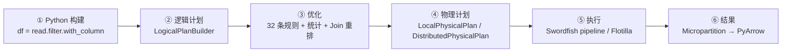

# Daft 深度剖析：面向 AI 与多模态工作负载的数据引擎

<div class="lead">
本文以 Daft 官方仓库 <code>main</code> 分支（commit <code>dadd8a0</code>，2026-09-25，对应 v0.7.25 线）为基准，
从<b>源码级</b>拆解它的分层架构、逻辑计划与优化器、单机流式引擎 Swordfish、分布式引擎 Flotilla、
IO 与 Parquet 读取器，以及多模态与 AI 能力的真实落点。文中所有关键结论都标注了
<code>文件:行号</code>，可直接回溯核对；共 14 张插图，覆盖架构、数据流与关键算法。
</div>

<div class="meta-cards">
  <div class="card"><b>项目定位</b><span>多模态数据引擎</span></div>
  <div class="card"><b>核心实现</b><span>Rust（50+ crate）</span></div>
  <div class="card"><b>接口</b><span>Python DataFrame + SQL</span></div>
  <div class="card"><b>执行模式</b><span>单机 Swordfish / 分布式 Flotilla</span></div>
  <div class="card"><b>内存模型</b><span>Arrow（arrow-rs 59）</span></div>
  <div class="card"><b>许可</b><span>Apache 2.0</span></div>
</div>

## 0. 导读：三句话认识 Daft

1. **它是一个“多模态优先”的数据引擎**：图片、音频、视频、文档、张量、嵌入向量与结构化数据同处一张表、同一套算子、同一个计划里，而不是把非结构化数据塞进 `bytes` 列自生自灭。
2. **它的形态是“Python 门面 + Rust 内核”**：Python 侧只负责构建逻辑计划、承载 UDF 与模型推理；优化、调度、算子内核、IO 全在 Rust，通过 Arrow C Data Interface 与 PyArrow 零拷贝交换数据。
3. **它的执行是“声明式 + 流式”**：用户写的是声明式 DataFrame/SQL，引擎把它编译成逻辑计划、经过 30+ 条规则与代价模型改写成物理计划，最后变成一张 **morsel 驱动的 push 流水线**，在单机（Swordfish）或集群（Flotilla）上以有界内存流式执行。

如果你只记一件事：**Daft 把“行很大、行会变大、算力在 GPU、数据在对象存储”这类负载，当成一等公民来设计查询引擎**——这正是它与 Spark / Ray Data / Polars 的分水岭。

### 0.1 本文路线图

| 章节 | 你会得到什么 | 关键词 |
|---|---|---|
| 1–3 章 | 定位、API 全貌、分层架构与源码地图 | 三层架构、惰性求值、crate 地图 |
| 4 章 | 数据模型与零拷贝机制 | Micropartition、Series、扩展类型 |
| 5 章 | 逻辑计划、表达式系统与 SQL 前端 | LogicalPlan、Expr、FunctionRegistry |
| 6 章 | 优化器：规则、统计与代价 | 32 条规则、UDF 拆分、Join 重排 |
| 7–9 章 | 物理计划、Swordfish、Flotilla | Pipeline 图、morsel、调度、shuffle |
| 10 章 | IO 与 Parquet 读取器 | ScanTask、下推、range GET |
| 11 章 | 多模态与 AI 能力的真实落点 | 解码、tiktoken、provider |
| 12–14 章 | 调优手册、二次开发、局限与选型 | 配置速查、扩展点、能力缺口 |

> **阅读建议**：想看结论直接跳第 12 章“性能与调优手册”和第 14 章“设计取舍与局限”；想看源码请从第 3 章的 crate 地图与每章末尾的源码地图表入手。

## 1. Daft 是什么

### 1.1 一句话与六个特性

官方定位是 *high-performance data engine for AI and multimodal workloads*（`README.rst:9-18`）：

- **原生多模态处理**：图片、音频、视频、嵌入与结构化数据在同一个框架内处理。
- **内置 AI 操作**：`embed_text` / `prompt` / `classify_*` 等 AI 函数直接作为表达式使用，可接 OpenAI、Transformers、vLLM 或自定义模型。
- **Python 原生、Rust 驱动**：无 JVM 负担，Python API + Rust 内核。
- **无缝扩展**：本地开发，`daft.set_runner_ray()` 或 Kubernetes 上扩展。
- **通用连接**：S3 / GCS / Azure / Iceberg / Delta / HuggingFace / Unity Catalog 等。
- **开箱可靠**：智能内存管理与默认值，尽量免除手工调参。

### 1.2 它要解决的核心矛盾

传统分析引擎的隐含假设是“**行很小、行会变少**”：过滤、聚合、Join 让数据在流水线中不断收缩，所以“把分区整体读进内存再逐算子处理”是安全的。多模态负载把这个假设彻底推翻：

| 维度 | 传统分析负载 | 多模态 / AI 负载 |
|---|---|---|
| 行大小 | 几十字节~几 KB | 几 MB ~ 几 GB（PDF、视频、点云） |
| 行在流水线中的变化 | 越算越少 | **越算越大**（下载、解码、解压、explode） |
| 计算密度 | CPU 稠密、向量化 | CPU + **GPU** + 外部 API（LLM/嵌入） |
| IO 形态 | 顺序读大文件 | 高并发小/大混合读 + HTTP + 对象存储 |
| 失败模式 | 慢 | **OOM**、连接耗尽、GPU 饥饿 |
| 代码形态 | 声明式 SQL | 声明式 DataFrame + **大量 Python UDF** |

Daft 的设计几乎处处在回应这张表：流式 morsel 执行对抗“越算越大”，UDF 独立成算子树节点以便单独控制批次与并发，异步执行对抗 IO 等待，GPU 资源请求参与分布式调度。

### 1.3 与同类项目的对比

Daft 官方 README 给出的对照表（`README.rst`）如下，我补充了点评：

| 引擎 | 查询优化器 | 多模态 | 分布式 | Arrow 内存 | 向量化执行 | Out-of-core |
|---|---|---|---|---|---|---|
| **Daft** | ✅ | ✅ | ✅ | ✅ | ✅ | ✅ |
| Pandas | ❌ | Python 对象 | ❌ | 可选 ≥2.0 | 部分（NumPy） | ❌ |
| Polars | ✅ | Python 对象 | ❌ | ✅ | ✅ | ✅ |
| Modin | ✅ | Python 对象 | ✅ | ❌ | 部分（Pandas） | ✅ |
| Ray Data | ❌ | ✅ | ✅ | ✅ | 部分（PyArrow） | ✅ |
| PySpark | ✅ | ❌ | ✅ | Pandas UDF/IO | Pandas UDF | ✅ |
| Dask DF | ❌ | Python 对象 | ✅ | ❌ | 部分（Pandas） | ✅ |

**怎么选**：

- 纯结构化、单机、追求极致延迟 → **Polars / DuckDB** 更合适。
- 已经在 Ray 生态里做通用任务编排 → Ray Data 更通用，但缺少查询优化器与专为多模态设计的流式算子。
- 既有大规模结构化 ETL，又有图像/音频/PDF/嵌入 → **Daft 是少数同时具备“查询优化器 + 多模态类型 + 流式执行 + 分布式”的选项**。

### 1.4 版本与生态现状

| 项 | 值 |
|---|---|
| 本文基准 | `main` @ `dadd8a0`（2026-09-25），对应 v0.7.25 线 |
| 最新发布 | v0.7.25（2026-09-11） |
| Rust 版本线 | workspace `0.3.0-dev0`（`Cargo.toml:498`） |
| Arrow | arrow-rs **59.0.0**（`Cargo.toml:253-263`），**已无 arrow2 依赖** |
| Python | ≥ 3.10，可选 extras：`ray`、`aws`、`iceberg`、`deltalake`、`lance`、`unity`… |
| 部署 | 本地进程 / Ray 集群（含 KubeRay）/ Kubernetes Helm chart（`k8s/charts/quickstart/`） |

## 2. 快速上手与 API 全貌

### 2.1 安装

```bash
pip install daft                      # 核心
pip install "daft[ray]"               # 分布式（Ray）
pip install "daft[aws]"               # S3 凭据与工具
pip install "daft[iceberg,deltalake,lance]"
```

### 2.2 五个核心概念

| 概念 | Python 对象 | Rust 对应 | 说明 |
|---|---|---|---|
| DataFrame | `daft.DataFrame` | `LogicalPlanBuilder` / `LogicalPlan` | 惰性的计划容器，不含数据 |
| Expression | `daft.Expression` | `Expr` | 列引用、字面量、函数调用、UDF 的表达式树 |
| Session | `daft.Session` | `Session`（`src/daft-session`） | 目录、命名空间、provider、函数的绑定作用域 |
| Context | `daft.context` | `DaftContext`（`src/daft-context`） | 全局执行/规划/IO 配置与事件总线 |
| Runner | `daft.runners` | `Runner`（`src/daft-runners`） | native（单机）或 ray（分布式），进程内只能设置一次 |

### 2.3 一个端到端的多模态例子

下面这段代码几乎逐行对应官方 Swordfish 博客里的图像分类流水线：

```python
import daft
from daft import col
from daft.functions import image_decode, url_download

df = (
    daft.read_parquet("s3://bucket/imagenet/sample_100k/*.parquet")   # ① 扫描 Parquet
    .filter((col("height") == 256) & (col("width") == 256))           # ② 谓词下推
    .with_column("bytes", url_download(col("url")))                   # ③ 高并发下载（异步 IO）
    .with_column("image", image_decode(col("bytes")))                 # ④ 解码为 Image 类型
    .with_column("tensor", col("image").apply(preprocess,            # ⑤ 行式 Python UDF
                                            return_dtype=daft.DataType.tensor(daft.DataType.float32())))
    .with_column("label", ResNet50(col("tensor")))                    # ⑥ 有状态类 UDF / 模型推理
    .limit(100)
)

df.write_lance("/tmp/output")     # ⑦ 触发执行：流式写出，零拷贝进 Lance writer
```

同一件事用 SQL 表达（表函数 + 已注册的 UDF 名称）：

```python
daft.sql("""
  SELECT label, count(*) AS n
  FROM read_parquet('s3://bucket/imagenet/sample_100k/*.parquet')
  WHERE height = 256 AND width = 256
  GROUP BY label
""").show()
```

`df.explain()` 可以把计划打印出来（第 5、6 章会反复用到这个工具）：

```
* Limit: 100
|
* Project: ...
|
* UDFProject: ResNetModel(...) as labels
...
* Filter: [col(height) == lit(256)] & [col(width) == lit(256)]
|
* GlobScanOperator
|   Glob paths = [s3://bucket/imagenet/sample_100k/*.parquet]
|   File schema = name#Utf8, height#Int64, width#Int64, url#Utf8
```

### 2.4 惰性语义与三类“物化”

理解 Daft 的执行时机，只需记住 `daft/dataframe/dataframe.py` 里的三件事：

1. **所有变换方法只更新计划**：`DataFrame.__init__` 只保存 `LogicalPlanBuilder` 与一个空的结果缓存（`dataframe.py:187-211`）。
2. **唯一执行入口是 `_materialize_results()`**（`dataframe.py:5631-5647`）：内部调用 `get_or_create_runner().run(builder)`。
3. **不同方法有不同的物化程度**：

| 方法 | 物化程度 | 源码位置 |
|---|---|---|
| `collect()` / `to_pydict()` / `to_pylist()` / `to_arrow()` | 全量物化 | `dataframe.py:5681`、`:5970`、`:6006` |
| `show(n)` | **只取前 n 行**：`limit(n, eager=True)` + 流式迭代，够数即 break | `dataframe.py:5703-5712` |
| `iter_rows()` / `to_arrow_iter()` | 流式迭代，不整体物化 | `dataframe.py:528`、`:616` |
| `write_parquet(...)` 等 | 先建写出计划，再 `collect()` 驱动 | `dataframe.py:1085-1098` 等 |

4. **结果会被缓存并回填计划**：`DataFrame._result_cache` 一旦有值，`_builder` 属性会把后续计划改成 `from_in_memory_scan(cache)`（`dataframe.py:213-233`）；缓存池是**弱引用字典**（`daft/runners/partitioning.py:402-423`），DataFrame 被回收即释放。

> 实践含义：`df.show()` 之后再 `df.collect()` 不会重新扫描；但对大型扫描后的 DataFrame，缓存会长期占内存——必要时用 `daft.execution_config_ctx(...)` 或放弃引用。

<!-- diagram:05-lifecycle caption="图 1 · 一次查询的完整生命周期：前三步是声明，materialize 操作是惰性与执行的分界线" -->



### 2.5 API 全景

| 类别 | 入口 | 说明 |
|---|---|---|
| 读取 | `daft.read_parquet/csv/json/avro/text/lance/iceberg/delta_lake/hudi/paimon/...` | Python 门面 + Rust 读取器（表格式在 Python 层） |
| 扫描器 | `daft.io.ScanOperator` / `DataSource` | 自定义数据源（Python 或 Rust） |
| 表达式 | `daft.col`、`daft.lit`、`daft.functions.*` | 221 处 Python 包装最终都走 Rust 函数注册表 |
| AI | `daft.functions.ai.embed_text/prompt/classify_text/...` | 100% Python 实现，基于 provider 抽象 |
| UDF | `@daft.func` / `@daft.func.batch` / `@daft.cls` / `@daft.udaf` | 支持并发、批次、返回值类型、GPU 资源声明 |
| 写出 | `write_parquet/csv/json/iceberg/delta_lake/lance/sink` | 由 `daft-writers` 与 Python 表格式库分担 |
| 运维 | `daft.subscribers.dashboard.launch()`、`daft.checkpoint`、OTel | 见第 9.9 与 12 章 |

## 3. 总体架构：分层、源码地图与运行时

### 3.1 三层架构与语言边界

Daft 把一次查询切成三段（`docs/architecture/index.md:3-82`）：

- **Planning（计划）**：Python DataFrame / SQL → `LogicalPlan` 算子树（描述 *what*）。
- **Optimization（优化）**：规则式改写 + 代价式 Join 重排 + 统计信息填充；多模态相关算子（UDF、下载、解码、推理）被**刻意隔离成独立节点**。
- **Execution（执行）**：优化后的计划翻译成本地或分布式物理计划，进一步编成 pipeline 图，由 Swordfish 以 morsel 流式执行。

<!-- diagram:01-layers caption="图 2 · Daft 端到端架构：接口层 / 计划层 / 执行层，以及 native 与 distributed 两条 Runner 路径" -->

**语言边界**是理解性能的关键：Python 侧只做三件事——构建计划、提供 UDF/模型的执行体、承接最终结果；Rust 侧负责其余全部。跨界数据走 Arrow C Data Interface（PyCapsule），正常情况下**零拷贝**（例外见 4.6 节）。

### 3.2 源码地图：50+ crate 的分工

```
src/
├── daft-core/            数组、Series、DataType、Literal          (36.7k 行)
├── daft-recordbatch/     列式批 RecordBatch + 表达式求值入口      (13.1k 行)
├── daft-schema/          DataType/Field/Schema/ImageMode 等类型定义
├── daft-micropartition/  执行期最小调度单元 Micropartition
├── daft-dsl/             Expr 树、类型推导、函数注册表            (9.9k 行)
├── daft-logical-plan/    LogicalPlan、Builder、优化器             (28.0k 行)
├── daft-local-plan/      LocalPhysicalPlan + 逻辑→本地物理翻译
├── daft-local-execution/ Swordfish：pipeline、算子、sink、统计    (22.6k 行)
├── daft-distributed/     Flotilla：调度器、任务、worker、物化     (20.6k 行)
├── daft-shuffles/        shuffle 写/读、Flight server/client
├── daft-runners/         Runner 单例与配置推断
├── daft-scan/            ScanOperator、ScanTask、下推             (7.8k 行)
├── daft-io/              IOClient、ObjectSource（OpenDAL）        (12.9k 行)
├── daft-parquet/         Parquet 读取器（arrow-rs）               (6.5k 行)
├── daft-csv/ json/ avro/ 其他列式格式读取器
├── daft-writers/         Parquet/CSV/JSON/IPC/Lance 写出          (4.7k 行)
├── daft-functions*/      16 个函数模块（utf8/list/json/temporal/…）
├── daft-image/ ai/ text/ mcap/ warc/  多模态与专用格式
├── daft-sql/             sqlparser AST → LogicalPlan              (9.4k 行)
├── daft-catalog/ session/ context/    目录、会话、全局配置
└── common/               treenode、runtime、metrics、py-serde、arrow-ffi、daft-config
```

<!-- diagram:02-crate-map caption="图 3 · Rust crate 职责分层：接口层 → 计划层 → 执行层 → 数据/IO 层" -->

### 3.3 运行时模型：三个 Tokio runtime

Daft 没有“一个大线程池”，而是按职责分开（`src/common/runtime/src/lib.rs`）：

| runtime | 线程数 | 用途 | 关键约束 |
|---|---|---|---|
| **driver runtime** | Python 场景下是 current-thread；非 Python 为 multi-thread（`src/daft-local-execution/src/run.rs:63-93`） | 只跑驱动/控制逻辑：投喂输入、路由输出、事件循环 | 不做重活 |
| **COMPUTE runtime** | `available_parallelism()`，线程名 `DAFTCPU-{id}`（`lib.rs:190-206`） | 算子并行、表达式求值、UDF（线程路径） | **禁止 `spawn_blocking`**（`lib.rs:177-180`） |
| **IO runtime** | `min(8, NUM_CPUS)`，线程名 `DAFTIO-{id}`（`lib.rs:208-227`） | 扫描任务、网络与磁盘 IO | 与计算解耦，避免 IO 抢占 CPU |

UDF 子进程会把 compute runtime 线程数设为 1（`daft/execution/udf_worker.py:42`），避免“每进程再并行”导致线程爆炸。

### 3.4 一次查询的调用链（本地路径）

```
df.collect()
 └─ DataFrame._materialize_results()                  daft/dataframe/dataframe.py:5631
     └─ NativeRunner.run(builder)                     daft/runners/native_runner.py:131-159
         ├─ builder.optimize(execution_config)        src/daft-logical-plan/src/builder/mod.rs:1102
         ├─ LocalPhysicalPlan.from_logical_plan_builder   src/daft-local-plan/src/translate.rs:21
         └─ NativeExecutor.run(plan, ...)             src/daft-local-execution/src/run.rs:212/448
             ├─ translate_physical_plan_to_pipeline   src/daft-local-execution/src/pipeline.rs:397
             └─ run_execution_loop                    src/daft-local-execution/src/run.rs:332
```

分布式路径把最后两步换成 `DistributedPhysicalPlan` → `PlanRunner` → Flotilla 调度器（见第 9 章）。

## 4. 数据模型：从 DataFrame 到 Arrow 缓冲区

### 4.1 类型层次

Daft 的每一层都有明确职责，越往下越贴近 Arrow 内存模型：

<!-- diagram:03-data-model caption="图 4 · 数据模型层次：DataFrame → PartitionSet → Micropartition → RecordBatch → Series/Array → Arrow buffer" -->

| 层 | 关键类型 | 源码 | 要点 |
|---|---|---|---|
| 用户对象 | `DataFrame` | `daft/dataframe/dataframe.py` | 只有计划 + 结果缓存 |
| 分区引用 | `PartitionRef` / `PartitionSet` | `src/common/partitioning/src/lib.rs:15-83` | 抽象出“本地/远端对象”的统一句柄 |
| 分区集实现 | `MicroPartitionSet` | `src/daft-micropartition/src/partitioning.rs:29-33` | 内部 `Arc<RwLock<BTreeMap<PartitionId, _>>>`，**用 BTreeMap 保证输出有序** |
| 执行单元 | `MicroPartition` | `src/daft-micropartition/src/micropartition.rs:34-53` | `{schema, chunks: Vec<RecordBatch>, metadata, statistics}`，**本身是物化的** |
| 列式批 | `RecordBatch` | `src/daft-recordbatch/src/lib.rs:67-72` | `{schema, columns: Arc<Vec<Column>>, num_rows}`，表达式求值的作用域 |
| 单列 | `Series{inner: Arc<dyn SeriesLike>}` | `src/daft-core/src/series/mod.rs:30-34` | 类型擦除的门面，25 个方法 |
| 物理数组 | `DataArray<T>` | `src/daft-core/src/array/mod.rs:40-46` | 持有 `arrow-rs ArrayRef` + **独立一份 validity bitmap** |

> 一个常见误解：Rust 侧已经没有 `Table` 类型（旧名已被 `RecordBatch` 取代，`src/daft-recordbatch/src/lib.rs:68`）；`MaterializedResult` 只存在于 Python（`daft/runners/partitioning.py:180`）。

### 4.2 DataType：Arrow 原生 + 7 个多模态逻辑类型

`DataType` 定义在 `src/daft-schema/src/dtype.rs:16-152`，可分为四组：

| 分组 | 变体 |
|---|---|
| Arrow 原生 | `Null` `Boolean` `Int8..Int64` `UInt8..UInt64` `Float16/32/64` `Decimal128(p,s)` |
| 时间 | `Timestamp(unit, tz)` `Date` `Time` `Duration` `Interval` |
| 二进制/文本 | `Binary` `FixedSizeBinary(n)` `Uuid` `Utf8` |
| 嵌套 | `FixedSizeList` `List` `Struct` `Map` `Union` |
| Arrow 扩展 | `Extension(name, storage, metadata)` |
| **Daft 逻辑扩展** | `Embedding(inner, size)` `Image(mode)` `FixedShapeImage` `Tensor` `FixedShapeTensor` `SparseTensor` `FixedShapeSparseTensor` `File(media_type)` |
| 其他 | `Python`（feature 门控） `Unknown` |

**逻辑类型 ≠ 物理表示**。`to_physical()` 决定它们在 Arrow 里怎么存（`dtype.rs:361-435`），这直接决定了零拷贝与解码成本：

| 逻辑类型 | 物理存储 | 工程含义 |
|---|---|---|
| `Image(mode)` | `Struct{data: List<UInt8>, channel, height, width, mode}` | 惰性：不解码就能读尺寸/通道 |
| `FixedShapeImage(mode,h,w)` | `FixedSizeList(dtype, C*h*w)` | 适合直接喂模型 |
| `Tensor(inner)` | `Struct{data, shape: List<UInt64>}` | 变长张量 |
| `FixedShapeTensor(inner, shape)` | `FixedSizeList(inner, prod(shape))` | 可映射为 PyArrow canonical 类型 |
| `Embedding(inner, size)` | `FixedSizeList(inner, size)` | 无 shape 元数据的定长向量 |
| `SparseTensor` | `Struct{values, indices, shape}` | CSR 风格 |
| `File(media_type)` | `Struct{url, io_config, position, size}` | 惰性文件句柄，可按 range 读 |

这一层与 PyArrow 的互操作由 `daft.super_extension` 承担：所有 Daft 逻辑类型都以“Arrow 扩展类型 + 完整 dtype JSON”的形式导出（`src/daft-schema/src/field.rs:126-145`），Python 侧对偶实现是 `daft/extension_type.py:11-32`。

### 4.3 分发机制：宏单态化 + Trait Object

Daft 没有用“`DataType` 大 match”到处分发，而是三步走（`src/daft-core/src/datatypes/matching.rs:2-65`）：

1. `with_match_daft_types!(dtype, |$T| ...)` 把运行时 `DataType` 单态化到类型级 `$T`；
2. 宏为每种数组生成 `impl SeriesLike for ArrayWrapper<A>`（`series/array_impl/data_array.rs:29-37` 等）；
3. 需要具体数组时 `Series::downcast::<Arr>()` 走 `Any::downcast_ref`（`series/ops/downcast.rs:21-30`）。

实例化清单可以直接当“支持哪些数组类型”的答案：`data_array.rs:158-176`（20 个）、`logical_array.rs:188-201`（13 个）、`nested_array.rs:165-168`（4 个）。匹配宏共 10 个（`matching.rs`），例如 `with_match_physical_daft_types!`、`with_match_hashable_daft_types!`，分别用于“只支持物理类型”和“可哈希”的算子。

### 4.4 Null 与字面量

- validity bitmap **单独持有一份引用**（`array/mod.rs:44`），`with_nulls()` 通过重建 ArrayData 覆写（`:200-219`）。
- 哈希/去重时 NULL 被显式跳过（`series/mod.rs:64-104`）。
- 标量用 `Literal` 枚举（`src/daft-core/src/lit/mod.rs:36+`），逐行取值走 `SeriesLike::get_lit`。

### 4.5 零拷贝：PyCapsule 优先，`_export_to_c` 兜底

PyArrow 互操作由自研 crate `common-arrow-ffi` 承担（不用 `arrow-pyarrow`，因为 pyo3 版本冲突，`src/common/arrow-ffi/src/lib.rs:1-5`）：

- **导出**走 Arrow PyCapsule Interface：`array_to_pycapsules`（`:418-429`），RecordBatch 按规范以 **StructArray** 形式导出（`:434-445`）。
- **导入**优先调用对象的 `__arrow_c_array__`（`:306-346`），失败才回退 `pyarrow.Array._import_from_c`（`:348-365`）。

**零拷贝失效的六种情况**（都是实践中会踩的）：

1. 类型不一致：只在 Utf8→LargeUtf8、Binary→LargeBinary 上自动 cast，其余报 `TypeError`（`array/mod.rs:122-162`）。
2. 未注册的 Arrow 扩展类型：`_import_from_c` 会丢 metadata，需用 `DaftExtension` 重新包装（`series.rs:600-622`）。
3. `FixedShapeTensor` 需要转成 PyArrow canonical 类型（`series.rs:625-629`）。
4. buffer 未按 64 字节对齐时会 `align_buffers()` 触发拷贝（`series.rs:575-598`）。
5. `PyRecordBatch.from_arrow_record_batches` 有 schema 转换 + `concat`，是显式拷贝点（`ffi.rs:12-39`）。
6. Python 侧 `to_pydict()` / `to_pylist()` 必然逐值物化（`daft/recordbatch/recordbatch.py:178-192`）。

> 实践建议：跨语言边界尽量传 `Series` / `RecordBatch`，把它作为 UDF 的输入输出类型；一旦落到 `pylist`，多模态列（图片字节）会立刻放大内存。

### 4.6 多模态能力的真实实现层次

这是最容易产生误解的部分，直接给结论表：

| 能力 | 实现层 | 证据 |
|---|---|---|
| 图片编解码 / resize / crop | **Rust**，但只是 `image` crate 的封装 | `src/common/image/src/cow_image.rs:109-132`；`src/daft-image/src/ops.rs:316-343`（rayon 元素级并行） |
| 图片 GPU 解码 / SIMD 内核 | **不存在**（搜索 `nvjpeg`/`npp`/`simd` 无命中） | `daft-image` 依赖仅 `common-image`/`image`/`rayon`/`rustfft` |
| CSV/JSON 字节→Arrow 反序列化 | **Rust**，全仓唯一 SIMD 热点 | `src/daft-decoding`：`simdutf8`、`atoi_simd`、`fast-float2` |
| 文本 tokenize | **Rust**，`tiktoken-rs`，输出 `List<UInt32>` | `src/daft-functions-tokenize/src/bpe.rs:9`、`encode.rs:76-79` |
| 文本文件读取 | Rust（不是 tokenizer） | `src/daft-text/src/read.rs:50-56` |
| 向量距离（cosine/dot/euclidean） | Rust，标量循环，无 BLAS | `src/daft-functions/src/distance/*.rs`、`vector_utils.rs:61-80` |
| 向量索引 / ANN 检索 | **外委** Lance（`daft-lance` 包） | `pyproject.toml:47`；`daft/io/lance/_lance.py:20-76` |
| 音频解码 / 重采样 | **Python**（soundfile / librosa） | `daft/file/audio.py:6,94` |
| 视频解码 | **Python**（PyAV） | `daft/io/av/_read_video_frames.py:10,139,159` |
| PDF 解析 | **不存在解析器**，只能当字节喂模型 | `daft/functions/ai/__init__.py:468`；仅 MIME 嗅探 `src/daft-file/src/file.rs:406` |
| AI 函数（embedding/prompt/classify） | **100% Python**，`src/daft-ai` 只是 63 行的 provider 句柄桥 | `daft/functions/ai/__init__.py:72,157,250,329,453`；`src/daft-ai/src/provider.rs:3-14` |

**这条结论非常重要**：多模态的“重活”大多发生在 Python 侧（UDF / 外部包），因此**UDF 的 `batch_size` 与 `concurrency` 对性能的影响，往往大于引擎内部参数**。

## 5. 逻辑计划、表达式与 SQL

### 5.1 LogicalPlan：30 个算子变体

`LogicalPlan` 枚举定义在 `src/daft-logical-plan/src/logical_plan.rs:35-66`，`pub type LogicalPlanRef = Arc<LogicalPlan>`（`:78`）。按语义分组：

| 分组 | 变体 | 输出 schema 来源 |
|---|---|---|
| 数据源 | `Source` | 自持 `output_schema` |
| 投影 | `Project`、`UDFProject` | 自持（构造时逐表达式推导） |
| 过滤/行数/顺序 | `Filter`、`Limit`、`Offset`、`Sample`、`Sort`、`TopN`、`Distinct`、`Shuffle` | 透传 `input.schema()` |
| 分区 | `Repartition`、`IntoPartitions`、`IntoBatches`、`Shard` | 透传 |
| 结构变换 | `Explode`、`Unpivot`、`Pivot`、`Concat` | 多数自持 |
| 聚合/连接 | `Aggregate`、`Join`、`AsofJoin` | 自持 |
| 集合 | `Union`、`Intersect` | 取 `lhs.schema()` |
| 其他 | `Sink`、`Window`、`MonotonicallyIncreasingId`、`VLLMProject`、`SubqueryAlias`、`StageCheckpointKeys` | 自持 |

每个算子都统一携带 `plan_id / node_id / stats_state` 三个字段（由 builder 与优化器回填），并提供 `schema()`、`children()`、`with_new_children()`、`stats_state()`、`multiline_display()` 等公共能力（`logical_plan.rs:153-593`）。

**schema 在构造期即定型**，不存在“有类型/无类型算子”两套流程：

- `Project::try_new` 先做公共子表达式提取，再逐表达式 `expr.to_field(input.schema())`（`ops/project.rs:48-71`）；
- `Aggregate::try_new` = `exprs_to_schema(groupby ++ aggregations)`（`ops/agg.rs:42-45`）——即“分组键在前、聚合值在后”；
- `Join::try_new` 走 `infer_join_schema`，重名列通过插入 Project 消歧（`ops/join.rs:205,236-252`）。

`Source` 用 `SourceInfo` 四态抽象数据源（`source_info.rs:16-21`）：`InMemory` / `Physical` / `GlobScan` / `PlaceHolder`。其中 `PlaceHolderInfo` 是“schema 已知但数据未绑定”，SQL 规划与 DataFrame 中间态都用它。

### 5.2 Scan 算子：下推契约的载体

`ScanOperator` trait（`src/daft-scan/src/scan_operator.rs:14-70`）是与数据源之间的唯一契约：

```rust
pub trait ScanOperator: Send + Sync + Display + Debug + PyClassLike {
    fn name(&self) -> &str;
    fn schema(&self) -> SchemaRef;
    fn partitioning_keys(&self) -> &[PartitionField];
    fn can_absorb_filter(&self) -> bool;
    fn can_absorb_select(&self) -> bool;
    fn can_absorb_limit(&self) -> bool;
    fn statistics(&self) -> Option<Statistics> { None }      // 精确行数可短路优化器的估算
    fn supports_count_pushdown(&self) -> bool { false }
    fn to_scan_tasks(&self, pushdowns: Pushdowns) -> DaftResult<Vec<ScanTaskRef>>;  // 核心
}
```

`Pushdowns`（`pushdowns.rs:16-36`）承载六类下推信息：`filters` / `partition_filters` / `columns` / `limit` / `sharder` / `aggregation`。

`ScanState` 有两态：`Tasks(Arc<Vec<ScanTaskRef>>)` 与 `Operator(ScanOperatorRef)`；**`Operator` 显式禁止序列化**（`scan_state.rs:36-45`），因为扫描任务必须在 driver 端物化后才能分发到 worker。物化入口是 `Source::build_materialized_scan_source`（`ops/source.rs:74-120`）。

### 5.3 表达式系统

`Expr` 有 23 个变体（`src/daft-dsl/src/expr/mod.rs:222-307`），核心是八类：

| 类别 | 变体 | 说明 |
|---|---|---|
| 引用 | `Column`、`Literal` | 列与标量 |
| 变换 | `Alias`、`Cast` | 命名与类型转换 |
| 运算 | `BinaryOp`、`Not`、`IsNull`、`Between`、`IsIn`、`Coalesce`、`IfElse` | 标量运算 |
| 函数 | `Function`（旧式 `FunctionExpr`）、`ScalarFn`（新式 `ScalarUDF`） | 两代函数框架并存 |
| 聚合 | `Agg(AggExpr)` | 21 个聚合变体（含 map-combine-reduce 三态） |
| 窗口 | `Over`、`WindowFunction` | 必须由窗口算子求值，不能直接 eval |
| 子查询 | `Subquery`、`InSubquery`、`Exists` | **不可序列化**（`expr/mod.rs:81-93`） |
| 特殊 | `VLLM`、`List` | vLLM 提示、列表构造 |

**列引用有三态**（`expr/mod.rs:115-181`），这是理解解析与绑定的关键：

```
Column::Unresolved{name, plan_ref, plan_schema}   ← 用户写的 col("a") / col("df.a")
Column::Resolved(Basic | JoinSide(field, side) | OuterRef(field, plan_ref))
Column::Bound{index, field}                        ← 物理执行时按 index 取列
```

**类型推导唯一入口是 `Expr::to_field(&Schema) -> Field`**（`expr/mod.rs:2085+`），`get_type` / `get_name` 都是它的薄封装。一个反直觉的事实：**Daft 的 `Field` 只有 `name/dtype/metadata`，没有 nullability**（`src/daft-schema/src/field.rs:27-31`），只有导出 Arrow 时默认 `nullable=true`（`:162`）——因此类型推导只决定 name + dtype。

**函数注册是显式集中式的**，没有任何自动注册宏：

```rust
// src/daft-dsl/src/functions/mod.rs:131-192
pub struct FunctionRegistry { map: HashMap<String, Arc<dyn ScalarFunctionFactory>> }
pub trait FunctionModule { fn register(parent: &mut FunctionRegistry); }
pub static FUNCTION_REGISTRY: LazyLock<RwLock<FunctionRegistry>> = ...;

// src/lib.rs:164-196 —— 全仓唯一注册点
functions_registry.register::<daft_functions::numeric::NumericFunctions>();
functions_registry.register::<daft_image::functions::ImageFunctions>();
// …共 16 个 register::<XFunctions>() + 12 个 add_fn / add_async_fn
```

源码注释直接把原因写在脸上：*"We need to do this here because it's the only point in the rust codebase that we have access to all crates"*。新增一个内置函数只有三步（以 `chr` 为例，`daft-functions-utf8/src/chr.rs:20-97`）：

```rust
#[derive(Clone, Serialize, Deserialize, PartialEq, Eq, Hash)]
pub struct Chr;

#[typetag::serde]                       // ← 让函数可被 serde 派发（跨进程必需）
impl ScalarUDF for Chr {
    fn name(&self) -> &'static str { "chr" }
    fn call(&self, inputs: FunctionArgs<Series>, _ctx: &EvalContext) -> DaftResult<Series> { ... }
    fn get_return_field(&self, inputs: FunctionArgs<ExprRef>, schema: &Schema) -> DaftResult<Field> { ... }
}

pub fn chr(input: ExprRef) -> ExprRef { ScalarFn::builtin(Chr {}, vec![input]).into() }
```

Python 侧是**手写包装**（无 codegen）：`daft/functions/*.py` 里 221 处调用最终都变成一次“按名字查表”：

```python
# daft/expressions/expressions.py:445-449
f = native.get_function_from_registry(func_name)
return cls._from_pyexpr(f(*expr_args, **expr_kwargs))
```

### 5.4 表达式解析器

`ExprResolver`（`src/daft-logical-plan/src/builder/resolve_expr.rs:291-297`）携带上下文标志：`allow_actor_pool_udf`、`allow_monotonic_id`、`allow_explode`、`in_agg_context`、`groupby`，据此拒绝越权用法。

- 通配符 `col("*")` 由 `expand_wildcard` 展开，多个通配符报错（`:21-126`）；
- 未解析列经 `resolve_to_basic_and_outer_cols` 变成 `ResolvedColumn::Basic`，带 `plan_schema` 的变成 `OuterRef`（相关子查询），否则 `FieldNotFound`（`:236-256`）；
- 歧义列由 schema 层报 `AmbiguousReference`（`src/daft-schema/src/schema.rs:129-145`）。

### 5.5 SQL 前端：同一个计划，两套语法

- **解析器**：直接用 crates.io 的 `sqlparser 0.59.0`（`Cargo.toml:364`），方言 `GenericDialect`，并先用 `tokenize_with_location()` 生成带 caret 的报错（`daft-sql/src/planner.rs:36,50-95,318`）。仓库里**没有** `daft-sqlparser` crate，也没有 `[patch]`。
- **规划器**：`SQLPlanner`（`planner.rs:165-178`）持有 `context: Rc<RefCell<PlannerContext>>`（CTE 绑定）、`parent`（外层作用域）、`right_side_plan`（join 右表）、`bound_columns`（SELECT 别名）。**没有 `Relation` trait**，关系规划走 `plan_relation` → `plan_relation_table`（先查 CTE 再 `session.get_table`）。
- **支持范围**：`Query` / `Explain` / `ShowTables` / `Use` / `CreateTable`；`UNION`（含 ALL/BY NAME）/ `INTERSECT` 支持；`VALUES` / `INSERT` / `UPDATE` / `DELETE` / `MERGE` 明确不支持（`planner.rs:463-468`）；`UNNEST`、`PIVOT`、`MATCH_RECOGNIZE` 等表因子不支持。
- **函数**：`SQL_FUNCTIONS` 手写注册 SQL 专有模块（聚合/窗口/表函数），随后**把 `FUNCTION_REGISTRY` 里所有标量函数自动注册为 SQL 透传**（`daft-sql/src/functions.rs:84-97`）。
- **统一性**：SQL 直接产出 `LogicalPlanBuilder`（`statement.rs:5`），`execute_select` 返回 `LogicalPlanRef`，Python 入口 `daft/sql/sql.py:77` 再包成 `DataFrame`。**SQL 与 DataFrame 共享同一套算子、同一套优化器**。

## 6. 优化器：规则、统计与多模态感知

### 6.1 框架：一个方法、两个策略、三重终止

优化器的抽象极简（`src/daft-logical-plan/src/optimization/rules/rule.rs:8-14`）：

```rust
pub trait OptimizerRule {
    fn try_optimize(&self, plan: Arc<LogicalPlan>) -> DaftResult<Transformed<Arc<LogicalPlan>>>;
}
```

注意：**没有 `apply`/`transform` 抽象方法**，遍历原语由每条规则自己在 `try_optimize` 内选择（`transform` = 后序、`transform_down` = 前序、`rewrite` 等，`src/common/treenode/src/lib.rs:202-234`）。判断一条规则是自顶向下还是自底向上，必须看它内部用了哪个原语。

批与策略（`optimization/optimizer.rs:24-106`）：

| 概念 | 定义 |
|---|---|
| `RuleBatch` | `{ rules: Vec<Box<dyn OptimizerRule>>, strategy }` |
| `RuleExecutionStrategy` | `Once`（跑一轮）或 `FixedPoint(Option<usize>)`（跑到不动点） |
| `OptimizerConfig` | `default_max_optimizer_passes = 20`、`strict_pushdown = false` |

**终止条件有三重**（`optimizer.rs:345-386`）：

1. 某一轮所有规则都没改写计划 ⇒ 到达固定点，退出该批次；
2. 改写了但计划摘要重复出现 ⇒ **判定为环**，提前退出（摘要 = `plan hash + 节点数`，`logical_plan_tracker.rs:20-67`）；
3. 达到 `max_passes`。

一个细节：`AlwaysSame<PlanStats>` 让带统计信息的计划在 `PartialEq/Hash` 上忽略 stats（`stats.rs:59-96`），否则“计划是否变化”与“环检测”会被 stats 干扰。

### 6.2 规则执行序列（源码顺序）

调度顺序硬编码在 `optimizer.rs`，按分支列出（完整 32 条）：

| 批次 | 规则（顺序） | 策略 |
|---|---|---|
| **批次 1：默认规则** | `LiftProjectFromAgg`、`RewriteCountDistinct`、`UnnestScalarSubquery`、`UnnestPredicateSubquery`、`EliminateSubqueryAliasRule`、`ExtractWindowFunction`、`SplitExplodeFromProject`、`SimplifyExpressionsRule`、`FilterNullJoinKey`、`PushDownAntiSemiJoin`、`DropRepartition`、`DropIntoBatches`、`PushDownFilter`、`PushDownProjection`、`EliminateCrossJoin`、`SimplifyNullFilteredJoin`、`PushDownJoinPredicate`、`EliminateOffsets`、`RewriteOffset`、`PushDownLimit`、`SplitUDFsFromFilters`、`SplitUDFs`、`SplitVLLM`、`PushDownProjection`（二次）、`DetectMonotonicId`、`PushDownProjection`（三次）、`PushDownAggregation`、`PushDownShard`、`RewriteCheckpointSource`、`SimplifyExpressionsRule`（二次）、`MaterializeScans`、`ShardScans` | 多为 `FixedPoint(None)`；`FilterNullJoinKey`/`SplitUDFs*`/`MaterializeScans` 等为 `Once`；`RewriteOffset`/`PushDownLimit` 为 `FixedPoint(Some(3))` |
| **批次 2：Join 重排**（可关闭） | `ReorderJoins` + `PushDownFilter` + `PushDownProjection` + `EnrichWithStats` | — |
| **批次 3：统计与细粒度拆分** | `EnrichWithStats`、`SimplifyExpressionsRule`、`SplitGranularProjection` | — |

<!-- diagram:06-optimizer caption="图 5 · 优化器执行框架：规则分批 + 固定点迭代 + 环检测；UDF/下载被刻意隔离成独立节点" -->

### 6.3 规则逐条剖析（挑最关键的七条）

**① PushDownFilter**（`rules/push_down_filter.rs`）：`transform_down` 前序遍历。谓词会尝试穿过 `Source / Project / Filter / Join / Sort / Shuffle / Repartition / IntoBatches / IntoPartitions / Concat`，遇到其他算子则阻挡。两个值得记住的细节：

- 谓词会被**三路划分**为 `partition_only_filter` / `data_only_filter` / `needing_filter_op`（`src/daft-scan/src/expr_rewriter.rs:84-142`）：前两者写入 scan 的 `Pushdowns`，含 UDF 的谓词只能回退成 Filter 算子；
- 穿 Join 时要判断谓词列属于左、右还是两侧；对 anti/semi join，若谓词列不是 join key，**只能推到左侧**——否则会改变语义（源码里挂着 issue #6086 的注释，`push_down_filter.rs:383-403`）。

**② PushDownProjection**（`rules/push_down_projection.rs`）：`transform_down`。除了把列裁剪写进 scan（`pushdowns.columns`，仅当 `ScanState::Tasks`），还负责：

- 消除 no-op 投影（同长度、逐列同名裸列）；
- 合并 Project-Project，但**只有上游“需计算列”在下游被引用 ≤1 次才合并**（避免表达式膨胀，用 `IndexSet::insert` 的返回值判定，`:64-138`）；
- 在 Sort/Repartition/Limit/Filter 等一元算子之上插入 Project 以缩短上游（`:291-336`）。

**③ PushDownLimit**（`rules/push_down_limit.rs`）：可穿 `Repartition / IntoBatches / IntoPartitions / Project（无 Explode）/ Source / Limit / Sort / Join(Left, Right)`。若下游已存在更紧的 Limit 则整体 no-op，避免反复包裹造成 ping-pong（`:259-272`）。

**④ SplitUDFs / SplitUDFsFromFilters**（`rules/split_udfs.rs`）：把 UDF 从普通 `Project` 中拆出来，形成独立的 `UDFProject` 节点；这也是为什么 `df.explain()` 里会出现一堆 `UDFProject`。**动机有三**：UDF 需要自己的批次与并发控制；UDF 不应该被下推到扫描；UDF 需要独立上报指标与背压。

**⑤ SplitGranularProjection**（`rules/granular_projections.rs`）：把“需要独立 morsel 尺寸”的表达式（当前判定：内建异步函数且 `preferred_batch_size()` 有值）拆成单独 Project，并把子表达式用 `id-{uuid}` 别名 + 列引用替换（`:44-107`）。示例：`Project(decode(url_download(...)) as image, name)` 会被拆成三层 Project。

**⑥ EliminateCrossJoin / UnnestSubquery**：前者重写自 DataFusion（`eliminate_cross_join.rs:1`），把带等值条件的 cross join 转成 inner join；后者把标量/谓词子查询改写成 `CROSS JOIN + 过滤`（`unnest_subquery.rs:21-40`）。`SubqueryAlias` 只做命名边界消除。

**⑦ ReorderJoins**（`rules/reorder_joins/`）：构建 join graph 后用代价枚举选最优顺序。默认 `BruteForceJoinOrderer`，关系数上限 `BRUTE_FORCE_MAX_RELATIONS = 7`；实验性 DP-ccp（Moerkotte & Neumann 2006）把上限提到 12，通过 `DAFT_DEV_ENABLE_DP_CCP_JOIN_ORDERING=1` 打开（`reorder_joins/mod.rs:21-59`）。

### 6.4 统计信息：从哪来、谁在用

**两套统计**，别混淆：

- `PlanStats / ApproxStats`（`src/daft-logical-plan/src/stats.rs:105-111`）：`{num_rows, size_bytes, acc_selectivity}`，**参与优化决策**；
- `daft-stats` 的 `TableStatistics`（列级 min/max 区间，`src/daft-stats/src/table_stats.rs:21-25`）：目前**不参与逻辑优化决策**（源码注释直言只放了基数统计，`stats.rs:23-25`）。

填充由 `EnrichWithStats` 自底向上完成（`enrich_with_stats.rs:29-42`），前提是 scan 必须先物化。数据来源（`ops/source.rs:91-152`、`src/daft-scan/src/lib.rs:623-665`）：

1. scan operator 报告精确行数 ⇒ 直接短路；
2. 否则用 Parquet/文件 metadata 的 `length`（精确）；
3. 再否则用 `size_bytes × inflation_factor ÷ 行宽` 估算——`parquet_inflation_factor` 默认 **3.0**、`csv` 0.5、`json` 0.25（`daft-config/src/lib.rs:178-182`）。

消费方包括：`ReorderJoins` 的代价估计、分布式 join 策略选择（broadcast vs hash，阈值 10 MiB）、shuffle/聚合/窗口/排序的分区数决策（`pipeline_node/translate.rs:374-627`）。

### 6.5 优化器的多模态哲学

官方架构文档把这点写得很清楚（`docs/architecture/index.md:40`）：**昂贵的投影（Python UDF、模型推理、URL 下载、图片解码）会被隔离成独立的逻辑节点，且刻意不推入 scan**；它们会被执行得“尽可能晚，但在正确性允许的范围内”，以减少对将被丢弃行的无效计算。

这条设计带来两个直接后果：

1. `df.explain()` 中出现大量 `UDFProject` 是**设计使然**，不是计划没优化好；
2. 想让昂贵算子少干活，正确做法是**先用 filter/join/聚合把行数打下来**，而不是指望优化器把它们推到扫描里。

<!-- diagram:07-plan-rewrite caption="图 6 · 同一个查询优化前后的逻辑计划：谓词/Limit/列裁剪下推，Project 折叠，UDF 拆分为独立节点" -->

## 7. 从逻辑计划到物理计划

优化后的逻辑计划仍是“要做什么”，物理计划才回答“在哪做、怎么做”。

### 7.1 本地路径：`daft-local-plan`

入口是一个纯函数（`src/daft-local-plan/src/translate.rs:21-27`）：

```rust
pub fn translate(plan: &LogicalPlanRef,
                 psets: &HashMap<String, Vec<MicroPartitionRef>>)
    -> DaftResult<(LocalPhysicalPlanRef, HashMap<SourceId, Input>)>;
```

`LocalPhysicalPlan` 有 36 个变体（`plan.rs:75-132`），大致对应逻辑算子，但**并非一一映射**。翻译期的关键改写规则：

| 逻辑算子 | 物理处理 | 源码 |
|---|---|---|
| `Shard` | **报错**（已折叠进 source） | `translate.rs:99-101` |
| `Repartition` / `IntoPartitions` | **no-op**（本地不做，warn 后翻译其 input） | `translate.rs:583-594` |
| `Shuffle` | 退化成按 `random_int_expr(i64::MIN, i64::MAX, seed)` 排序 | `translate.rs:392-409` |
| `Aggregate` | 按 `groupby.is_empty()` 分派 `UnGroupedAggregate` / `HashAggregate` | `translate.rs:227-250` |
| `Window` | 按 `(partition_by, order_by, frame)` 组合分派 4 种窗口算子 | `translate.rs:263-327` |
| `Join` | 非等值 join 报 not_implemented；无 key 的 inner → `CrossJoin`；其余 → `HashJoin` | `translate.rs:456-495` |
| `Sink` | 展开为 `PhysicalWrite→CommitWrite` / `CatalogWrite` / `LanceWrite` / `DataSink` | `translate.rs:610-667` |
| `Offset` / `Union` / `Intersect` / `SubqueryAlias` | **报错**“should already be optimized away” | `translate.rs:703-709` |

最后一行是个很有用的调试信号：**看到这个错误，说明优化器有规则没跑或跑漏了**，而不是数据问题。

每个物理节点都显式携带 `stats_state` 与 `LocalNodeContext`（例如 Filter 在 `translate.rs:102-114`），保证统计与节点元数据能一路带到执行层与 Dashboard。

### 7.2 分布式路径：`daft-distributed`

第一件需要纠正的事：**所谓“stage”并不是一个显式的数据结构**。该版本中不存在 `StagePlan` / `DistributedNode` / `TaskScheduler` 这些类型；真实模型是 **pipeline node DAG**：

- `DistributedPhysicalPlan` 只包 `{query_idx, query_id, logical_plan, config}`（`src/daft-distributed/src/plan/mod.rs:34-40`）——**它持有的是逻辑计划，物理化发生在运行时**；
- 翻译器 `LogicalPlanToPipelineNodeTranslator` 以 `TreeNodeVisitor::f_up`（后序）自底向上把逻辑计划变成 `DistributedPipelineNode` DAG（`pipeline_node/translate.rs:43-129`）；
- “stage 边界”由**算子类别 + 物化**隐式表达：`NodeCategory::{Intermediate, Source, StreamingSink, BlockingSink}`（`src/common/metrics/src/ops.rs:74-80`），遇到 `BlockingSink` 就调用 `materialize_all_pipeline_outputs` 把上游结果收齐（`pipeline_node/materialize.rs:23-93`）。

分布式翻译期还要做几个关键决策：

| 决策 | 判据 | 源码 |
|---|---|---|
| 是否需要 hash 重分区 | `can_skip_hash_repartition`：单分区直接跳过；clustering 键已被算子键覆盖也跳过 | `translate.rs:96-118` |
| Join 策略（broadcast / hash / sort-merge / cross） | `determine_join_strategy`：显式指定优先；小表 ≤ 10 MiB 且该侧可广播 ⇒ broadcast；否则 hash | `join/translate_join.rs:22-65` |
| 聚合分区数 | `shuffle_aggregation_default_partitions`（默认 200），两阶段聚合 | `aggregate.rs:254-340` |
| 排序 | 先采样求分位边界，再按 Range 重分区 | `sort.rs:88-181` |

### 7.3 Runner 选择

`RunnerConfig` 的推断顺序（`src/daft-runners/src/runners.rs:264-288`）：

1. 环境变量 `DAFT_RUNNER=native|ray`（`=py` 会明确报错：PyRunner 自 v0.5.0 起移除）；
2. 未设置时调 `detect_ray_state()` 探测 Ray 环境；
3. Runner 是 `OnceLock` 单例，**进程内只能设置一次**（`:294`）。

## 8. Swordfish：单机流式执行引擎

### 8.1 总体结构与入口

`daft-local-execution`（22.6k 行 Rust）的模块划分（`src/daft-local-execution/src/lib.rs:3-18`）：

```
src/
├── run.rs              NativeExecutor、driver 循环、输入投喂、结果路由
├── pipeline.rs         LocalPhysicalPlan → Pipeline 翻译、4 类节点 trait、morsel 需求传播（1716 行）
├── channel.rs          tokio mpsc 封装（有界/无界）
├── batch_manager.rs    按 input_id 缓冲 + 切批 + flush 生命周期
├── buffer.rs           RowBasedBuffer：行数驱动的 morsel 缓冲
├── dynamic_batching/   StaticBatchingStrategy / LatencyConstrainedBatchingStrategy
├── resource_manager.rs 全局内存配额 MemoryManager + MemoryPermit
├── intermediate_ops/   project / filter / explode / unpivot / into_batches / udf
├── sinks/              aggregate / grouped_aggregate / sort / top_n / pivot / dedup / repartition / write …
├── streaming_sink/     limit / sample / monotonically_increasing_id / async_udf / vllm
├── sources/            scan_task / in_memory / glob_scan / shuffle_read
├── join/               hash_join / sort_merge_join / cross_join / asof_join / build / probe
└── runtime_stats/      RuntimeStats、进度条、进程监控
```

入口链路：

```
NativeExecutor.run(plan)                 run.rs:212-248 / 448-569
 ├─ translate_physical_plan_to_pipeline  pipeline.rs:397
 ├─ physical_plan_to_pipeline            pipeline.rs:436  ← 对 LocalPhysicalPlan 的大 match
 └─ run_execution_loop                   run.rs:332
```

一个容易被忽略的优化：`NativeExecutor` 以 `plan_fingerprint` 缓存 pipeline（`run.rs:490-537`），**同一个算子的多个 `input_id` 复用同一条 pipeline**——这是本地 runner 也能处理多分区数据的关键。

### 8.2 Pipeline 节点模型

所有节点实现同一个 trait（`pipeline.rs:224-246`）：

```rust
pub(crate) trait PipelineNode: Sync + Send + TreeDisplay {
    fn children(&self) -> Vec<&dyn PipelineNode>;
    fn propagate_morsel_size_requirement(&mut self, downstream: MorselSizeRequirement,
                                         default: MorselSizeRequirement);
    fn start(self: Box<Self>, maintain_order: bool, runtime_handle: &mut ExecutionRuntimeContext)
        -> crate::Result<crate::channel::Receiver<PipelineMessage>>;
    fn node_id(&self) -> usize;
    fn node_info(&self) -> Arc<NodeInfo>;
    // …
}
```

`start` 是唯一启动接口：递归启动子节点拿到上游 `Receiver`，再 spawn 一个常驻 driver 任务，返回自己的 `Receiver`。

**节点间消息只有三种**（`pipeline.rs:83-95`）：

```rust
pub enum PipelineMessage {
    Morsel { input_id: InputId, partition: MicroPartition },
    FlightPartitionRef { input_id: InputId, partition_ref: FlightPartitionRef },
    Flush(InputId),          // 该 input 的上游已结束
}
```

四类节点 + 两类特殊节点：

| 节点 | trait / 关键方法 | 语义 | 典型算子 |
|---|---|---|---|
| **SourceNode** | `Source::get_data() -> SourceStream`（`sources/source.rs:140-151`） | 主动产出数据流 | `ScanTaskSource`、`InMemorySource`、`GlobScanSource`、`ShuffleReadSource` |
| **IntermediateNode** | `IntermediateOperator::execute(input, state, …) -> (State, MicroPartition)`（`intermediate_ops/intermediate_op.rs:41-69`） | 收到即算，**有状态可并发** | Project、Filter、Explode、Unpivot、IntoBatches、UDF（同步） |
| **BlockingSinkNode** | `BlockingSink::sink()` 累积 + `finalize(states)` 一次产出（`sinks/blocking_sink.rs:41-68`） | **全局物化**算子 | Aggregate、Sort、TopN、Pivot、Dedup、Repartition、Write |
| **StreamingSinkNode** | `StreamingSink::execute()` 返回 `NeedMoreInput/Finished`，`finalize` 可循环产出（`streaming_sink/base.rs:32-82`） | 可提前结束 | Limit、Sample、MonotonicId、AsyncUdf、VLLM |
| **JoinNode** | `JoinOperator`（`join/join_operator.rs:26-97`） | **双输入**（build 左 / probe 右） | HashJoin、SortMergeJoin、CrossJoin、AsofJoin |
| **ConcatNode** | `concat.rs:55-106` | 双输入串接，仅支持 `input_id=0` | — |

`pipeline.rs` 的 match 决定算子与节点的配对，其中**最关键的分叉在 UDFProject**（`pipeline.rs:673-707`）：

```rust
// 语义示意
if udf.is_async && !udf.use_process { StreamingSinkNode::new(AsyncUdfSink) }
else                                { IntermediateNode::new(UdfOperator) }
```

### 8.3 为什么是 Push 而不是 Pull

<!-- diagram:04-push-vs-pull caption="图 7 · Volcano 的 Pull 模型 vs Swordfish 的 morsel 驱动 Push 模型" -->

Swordfish 的核心循环是 `next_event`（`pipeline.rs:111-146`），它用 `tokio::select!` 在「上游消息」与「本节点 spawn 出去的任务完成」之间做选择，并且**只有 `task_set.len() < max_concurrency` 时才 recv 上游**（`pipeline.rs:121`）——这既是并发控制，也是全局背压的第一道闸门。

对比传统 Volcano 迭代器模型：

| | Volcano（Pull） | Swordfish（Push / morsel） |
|---|---|---|
| 驱动方 | 上层算子调 `next()` | 下层 Source 主动推送 |
| 一次处理单位 | 一行或一批 | morsel（`MicroPartition`） |
| IO 等待 | 阻塞整条调用栈 | 同线程池内交错执行其他 morsel |
| 背压 | 隐式（调用栈深度） | 显式（有界 channel + 并发门控） |
| 异步/GPU | 难以表达 | 原生支持（`tokio` + 资源请求） |

### 8.4 调度与并发

**并发模型**：`IntermediateNode` 在节点内维护 `operator_states: Vec<Op::State>`（长度 = `max_concurrency`）与一个 `OrderingAwareJoinSet`。每收到一个 morsel，先 `batch_manager.push`，再 `try_dispatch`：把 batch 与一个**空闲 state** 一起 spawn 到 compute runtime（`intermediate_op.rs:116-138`）。算子执行完把 state 交回池子——这就是“有状态算子的并发”实现方式。

任务抽象是 `ExecutionTaskSpawner`（`lib.rs:161-209`）：

- `spawn`：把 future 插桩 span 后交给 `RuntimeRef`；
- `spawn_with_memory_request`：**先向 `MemoryManager` 申请字节许可，拿到才执行**（`lib.rs:180-196`）。

`RuntimeTask` 内部是 `tokio::task::JoinSet`，**drop 即取消**（`src/common/runtime/src/lib.rs:57-85`）——Daft 的取消语义就建立在这条性质上。

**顺序保证**：`OrderingAwareJoinSet::new(maintain_order)`（`common/runtime/src/joinset.rs:201-213`）。当 `maintain_order=true`（默认）时使用 `OrderedJoinSet`：为每个任务记录 `tokio::task::Id`，乱序完成的结果先缓存进 `finished: HashMap`，`join_next` 始终按 spawn 顺序返回（`joinset.rs:131-198`）。

**典型算子的并发度**（很有参考价值）：

| 算子 | 并发度 | 源码 |
|---|---|---|
| Project | `num_cpus.div_ceil(parallel_exprs)`，并通过 `par_eval_expression_list` 并行求值表达式 | `intermediate_ops/project.rs:125-171` |
| Filter | = compute 池线程数，静态批策略 | `intermediate_ops/filter.rs:114-137` |
| Scan | `scantask_max_parallel`（默认 8；0 表示用满 CPU） | `sources/scan_task.rs:55-60` |
| Sort | **1**（全局物化） | `sinks/sort.rs:137-139` |
| Limit | **1**（全局配额） | `streaming_sink/limit.rs:135-137` |

扫描任务的限流方式值得一提：`spawn_scan_task_processor` 用 `JoinSet` + `pending_tasks: VecDeque`，靠 `while task_set.len() < max_parallel` 控制并发，并整体跑在 IO runtime 上（`scan_task.rs:99-130`）。

### 8.5 通道与背压：三道闸门

`channel.rs` 只有两种通道，没有花哨的容量枚举：

```rust
pub(crate) fn create_channel<T>(buffer_size: usize) -> (Sender<T>, Receiver<T>);   // :30-33
pub(crate) fn create_unbounded_channel<T>() -> (UnboundedSender<T>, UnboundedReceiver<T>);  // :54-57
```

**关键事实：节点间数据通道一律 `create_channel(1)`**——Source（`source.rs:268`）、Intermediate（`intermediate_op.rs:408`）、BlockingSink（`blocking_sink.rs:553`）、StreamingSink（`base.rs:546`）、Join（`join_node.rs:165`）。即**背压粒度 = 1 个 morsel**。

无界通道只用于两处：driver 投喂输入、结果回传（`pipeline.rs:455/481/501`、`run.rs:514/546`）。

三道闸门叠加的效果：

| 闸门 | 位置 | 作用 |
|---|---|---|
| ① 通道容量 1 | 节点之间 | 上游必须等下游取走 morsel |
| ② 并发门控 | `next_event`（`pipeline.rs:117-121`） | 任务占满并发槽就不再收上游 |
| ③ Scan 任务池 | IO runtime（`scan_task.rs:99-130`） | 限制同时在飞的扫描任务 |

<!-- diagram:08-swordfish-pipeline caption="图 8 · Swordfish pipeline 图：4 类节点、容量为 1 的通道、三道背压与 morsel 尺寸传播" -->

### 8.6 morsel 尺寸：自顶向下传播的需求

- 根节点以 `Flexible(0, default_morsel_size)` 起，逐层调用 `propagate_morsel_size_requirement`（`pipeline.rs:429-432`）；
- `combine_requirements` 定义两段区间的合并规则（`pipeline.rs:178-221`）；
- **两类算子会“切断”需求**：BlockingSink 强制子节点使用 default（`blocking_sink.rs:529-536`）；JoinNode 只把需求传给 probe（右侧），build 侧用 default（`join_node.rs:131-151`）。

`RowBasedBuffer` 的三种状态（`buffer.rs:110-149`）：

```
行数 < lower_bound   → 继续攒，不产出
lower ≤ 行数 ≤ upper → 整块产出
行数 > upper         → 切出 upper 行，余量塞回缓冲
```

尺寸相关配置（`src/common/daft-config/src/lib.rs:120-202`）：

| 配置 | 默认 | 说明 |
|---|---|---|
| `default_morsel_size` | **131 072 行** | 全局默认 morsel 上界 |
| `enable_dynamic_batching` | false | 动态批开关 |
| `dynamic_batching_strategy` | `"auto"` | 延迟约束策略 |
| `partial_aggregation_threshold` | 10 000 | 聚合预聚合阈值 |
| `high_cardinality_aggregation_threshold` | 0.8 | 聚合策略切换阈值 |

**动态批**（默认关闭）实现的是论文 *Optimizing LLM Inference Throughput via Memory-aware and SLA-constrained Dynamic Batching* 的 Algorithm 2：在 `[b_low, b_high]` 内二分搜索满足延迟约束的最大批量（`dynamic_batching/latency_constrained_strategy.rs:165-215`）。Project 用 `target=5s / tolerance=1s / α=2048 / δ=64`，UDF 用 `α=16 / δ=4`。

UDF 则可以强制固定批次：`batch_size` 会变成 `MorselSizeRequirement::Strict(n)`（`intermediate_ops/udf.rs:568-574`）。

### 8.7 内存管理与「没有 spill」的真相

内存管理器是全局单例（`resource_manager.rs:7-100`）：总配额取系统内存，可用 `DAFT_MEMORY_LIMIT` 覆盖；`request_bytes` 用 `Mutex<MemoryState> + Notify` 实现“不可满足就挂起等待”，`MemoryPermit::drop` 归还并唤醒等待者。

```rust
pub async fn request_bytes(&self, bytes: u64) -> DaftResult<MemoryPermit<'_>> {
    if bytes > self.total_bytes { return Err(DaftError::ComputeError(...)); }
    loop {
        if let Some(permit) = self.try_request_bytes(bytes) { return Ok(permit); }
        self.notify.notified().await;         // 挂起，直到有人归还
    }
}
```

**但必须说清楚一个事实：本地执行引擎没有磁盘 spill**。全仓 `spill` 关键字只命中 shuffle 相关注释；没有 `temp_dir` / `spill_threshold` 之类的执行期溢写开关。所有阻塞算子都是**纯内存累积**：

- `Sort`：`SortState::Building(Vec<MicroPartition>)` 全收完再 `concat + sort`（`sinks/sort.rs:18-41,80-101`）；
- `GroupedAggregate`：`SinglePartitionAggregateState { partially_aggregated, unaggregated }`（`sinks/grouped_aggregate.rs:111-116`）；
- `HashJoin` build 侧：`HashJoinBuildState { probe_table_builder, tables: Vec<RecordBatch> }`（`join/hash_join.rs:32-35`）。

真正落盘的是**分布式 shuffle**：`flight_shuffle` 会把分区写成 IPC 文件（见 9.6）。本地 `RepartitionSink` 在 Ray 后端把分区留在内存，在 Flight 后端才写文件（`sinks/repartition.rs:191-241`），缓冲区阈值 16 MiB ~ 256 MiB。

> **调优含义**：如果你的查询里有全局 Sort / 高基数聚合 / 大表 Hash Join，峰值内存由它们决定，`default_morsel_size` 帮不上忙；要么加分区（分布式）、要么换策略（broadcast/sort-merge）、要么加内存。

### 8.8 关键算子实现

**HashAggregate（`sinks/grouped_aggregate.rs`）**：构造时用 `populate_aggregation_stages_bound` 把聚合拆成 `partial_agg_exprs / final_agg_exprs / final_projections`（`:256-261`）。三种策略（`:27-32`）：

- `AggThenPartition`：先局部聚合再按 hash 分区；
- `PartitionThenAgg(threshold)`：先分区，单分区未聚合行数超阈值就局部聚合；
- `PartitionOnly`：仅分区（Python UDAF `MapGroups` 强制走这条）。

策略由**首个非空批次的基数比**决定并全局缓存：`estimated_num_groups / input.len() >= 0.8` ⇒ `PartitionThenAgg`，否则 `AggThenPartition`（`:177-217`，估算用 `RecordBatch::hash_rows` 去重计数）。

**HashJoin（`join/`）**：

- 两侧并行：`JoinNode::start` 同时启动 build（左）与 probe（右）两条链，用 `tokio::join!` 汇合（`join_node.rs:162-226`）；
- 两侧解耦靠 `BuildStateBridge`：以 `input_id` 为键的一次性就绪槽；probe 侧首次见到某 input 时先 `subscribe` 并等待 build 完成（`build.rs:20-76`、`probe.rs:338-354`）；
- 探测按 join 类型分派：`probe_inner` / `probe_left_right(_with_bitmap)` / `probe_outer` / `probe_anti_semi(_with_bitmap)`（`hash_join.rs:208-240`）；anti/semi + bitmap 时探测阶段不产出数据，全部推迟到 `finalize_probe`；
- build 侧选择（本地广播优化）：有统计时 inner/outer 选小侧；只有一侧有统计且 `size_bytes ≤ 10 MiB` 时优先把该侧作为 build；left/right/anti/semi 因为需要位图，要求另一侧小 1.5 倍才反转（`pipeline.rs:1130-1218`）。

**Sort / TopN**：Sort 是「全量收集 → concat → 一次性排序」，单并发、**无多路归并**（`sinks/sort.rs:80-101`）。TopN 是流式剪枝：每批先 `top_n(limit+offset)` 只留候选，finalize 时再合并取最终 TopN（`sinks/top_n.rs:100-139`）。

**Window（`sinks/window_base.rs`）**：`push` 阶段先按 hash 把数据散射到 `num_partitions` 个单分区状态（`:32-50`）；finalize 阶段 `partition_into_groups` → `sort_and_materialize_groups`（`:72-113`）。

**Limit**：真正的流式截断——state 只记 `remaining_skip/remaining_take`，逐批 slice，一旦产出足量立即返回 `Finished`，使上游通道关闭、上游任务被 drop 取消（`streaming_sink/limit.rs:55-106`）。

**Explode**：中间算子，统计里额外上报 `amplification = rows_out / rows_in`（`intermediate_ops/explode.rs:43-57`），并覆写 `next_batch` 做数据感知切分。

### 8.9 UDF 执行：三条路径

<!-- diagram:09-udf caption="图 9 · Python UDF 的三条执行路径：线程 / 子进程 actor pool / 异步与 GPU" -->

**并发度与资源推导**（`intermediate_ops/udf.rs:355-435, 564-574`）：

```
max_concurrency = get_optimal_allocation(resource_request)
                = (num_cpus / request.num_cpus).clamp(1, num_cpus)     // num_cpus 超出可用 CPU 直接报错
concurrency     = udf_properties.concurrency.unwrap_or(max_concurrency)
batch_size      = udf_properties.batch_size → MorselSizeRequirement::Strict(n)
memory_request  = resource_request.memory_bytes() → spawn_with_memory_request
```

**路径 A：线程内执行（默认）**。在 compute runtime 的工作线程上 `Python::attach` 取 GIL，调用 `initialize_udfs` + `RecordBatch::eval_expression_with_metrics`（`udf.rs:262-276`）。零拷贝、无序列化，但受 GIL 限制。

**路径 B：子进程 Actor Pool**。判定条件是 `use_process = (is_actor_pool_udf() || use_process) && is_arrow_dtype`——**含 Python object dtype 的列强制退回线程路径**（`udf.rs:381-393`）。Python 侧实现（`daft/execution/udf.py`）：

- 每个 `UdfHandle` = 一个 `subprocess.Popen([sys.executable, "-m", "daft.execution.udf_worker", socket_path, secret])`（`:84-95`）；
- 父进程用 `multiprocessing.connection.Listener` + 32 字节 authkey 建立 UNIX socket（`:61-64,98`）；
- **数据传输走共享内存**：父进程把 `RecordBatch.to_ipc_stream()` 写入 `SharedMemory`，子进程读取后 `unlink`（`:33-55,138-140`）；
- 为避免大输出把管道写满导致死锁，`eval_input` 用 `wait([conn, stdout_fd])` **同时**排空 stdout 与等待响应（`:142-159`）；
- 子进程把 compute runtime 线程数设为 1（`daft/execution/udf_worker.py:42`），并把初始化推迟到 `_READY` 之后。

**路径 C：异步 / GPU**。`AsyncUdfSink` 为每个 state 维护独立 `JoinSet`，默认最多 **64** 个在飞任务（`DAFT_MAX_ASYNC_UDF_INFLIGHT_TASKS`，`streaming_sink/async_udf.rs:151-163`）——适合 `await` 模型服务或 vLLM 推理：IO 等待期间不占线程。

**GPU 的归属**：`ResourceRequest` 有 `num_gpus` 字段（`src/common/resource-request/src/lib.rs:23-51`），但 `daft-local-execution` **只消费 `num_cpus()` 与 `memory_bytes()`**——GPU 分配属于分布式/Ray 调度层职责。

**失败语义**：本地执行**没有任务级重试**（`daft-local-execution` 内 grep `retry` 无命中），一次 UDF 异常直接沿 `DaftResult` 上抛并终止查询。

### 8.10 可观测性、错误与取消

- **统计接口**：`trait RuntimeStats`（`runtime_stats/values.rs:8-44`）提供 `add_rows_in/out`、`add_bytes_in/out`、`add_duration_us`、`increment_num_tasks`；各算子自带上报口径，例如 `FilterStats.selectivity`、`ExplodeStats.amplification`、`JoinStats`。
- **StatsManager**：`RuntimeStatsManager` 是独立 tokio 任务，按 `throttle_interval` 节流，每个 tick 采样进程统计 → 聚合活跃节点 → 更新进度条 → 广播事件（`runtime_stats/mod.rs:192-583`）。
- **进度条**：`ProgressBarMode::{Disabled, Enabled, Persist}`，由 `DAFT_PROGRESS_BAR` 决定；**Flotilla worker 强制 Disabled**（避免每节点都刷屏）。
- **Dashboard 出口**：本引擎不直接依赖 `daft-dashboard`，而是通过 `daft_context::Subscriber` 事件总线；`DashboardSubscriber` 把事件转成 HTTP POST 给 dashboard 服务（`src/daft-context/src/subscribers/dashboard.rs:78,611`）。
- **错误传播**：统一 `Error` 枚举并实现 `From<Error> for DaftError`，在 Python 边界还原类型（`lib.rs:258-301`）；`Runtime::execute_task` 用 `catch_unwind` 把 **panic 转成 `DaftError::ComputeError`**（`common/runtime/src/lib.rs:107-125`）。
- **取消**：`CancellationToken` 由 `NativeExecutor` 持有，`run_execution_loop` 用 `tokio::select! { biased; ... }` 把它置于最高优先级，并同时监听 Ctrl-C（`run.rs:351-360`）；`cancel_plan(fingerprint)` 直接 `plans.remove()`，**依赖 `RuntimeTask` 的 drop-abort 语义取消整条 pipeline**（`run.rs:626-629`）。

## 9. Flotilla：分布式执行引擎

### 9.1 架构与角色

<!-- diagram:10-flotilla caption="图 10 · Flotilla：driver 上的调度器 + 每节点一个 Swordfish worker；控制面走 Ray actor 调用，数据面走对象存储或 Arrow Flight" -->

| 角色 | 实现 | 关键类型 |
|---|---|---|
| Driver / 调度器 | 单进程内的事件循环 + 策略对象 | `SchedulerLoop`、`DefaultScheduler`、`Dispatcher`、`StatisticsManager` |
| Worker | 每个 Ray 节点一个 actor，内部跑完整 Swordfish | `RaySwordfishActor`（Python）、`RaySwordfishWorker`（Rust） |
| 任务 | 一次分区级执行 | `SwordfishTask { plan: LocalPhysicalPlanRef, inputs, psets, config, resource_request, strategy }`（`scheduling/task.rs:241-251`） |

**入口链**（从 Python 到调度循环）：

```
daft.set_runner_ray()                      daft/runners/__init__.py:129
 └─ RayRunner.run_iter                   daft/runners/ray_runner.py:620-671
     ├─ DistributedPhysicalPlan.from_logical_plan_builder   ray_runner.py:620-624
     └─ FlotillaRunner.stream_plan → RemoteFlotillaRunner   flotilla.py:786-816
         └─ PyDistributedPhysicalPlanRunner.run_plan        src/daft-distributed/src/python/mod.rs:260-330
             ├─ logical_plan_to_pipeline_node               pipeline_node/translate.rs:43
             └─ PlanRunner::run_plan → spawn_scheduler_actor  plan/runner.rs:159-189
```

### 9.2 Pipeline node DAG 与物化

每个节点实现 `PipelineNodeImpl`（`pipeline_node/mod.rs:344-361`）：`children()` / `produce_tasks()` / `multiline_display()`。`produce_tasks` 返回 task 流，`TaskBuilderStream` 在每个 `SwordfishTaskBuilder::build()` 时分配 `TaskID`、拼 `TaskContext`、抽取资源请求（`mod.rs:491-541`）。

**物化**是 stage 边界的真正实现（`pipeline_node/materialize.rs:23-93`）：`materialize_all_pipeline_outputs` 起两条协程——`task_finalizer`（提交任务）与 `task_materializer`（用 `OrderedJoinSet` 保序收结果）。各阻塞算子的具体做法：

| 算子 | 物化方式 | 源码 |
|---|---|---|
| Repartition | 先 `local_shuffle_write_node.materialize(...)`，再交 shuffle 后端发 reduce 任务 | `shuffles/repartition.rs:76-92` |
| BroadcastJoin | 把 broadcast 侧整个 `try_collect`，再 `into_in_memory_scan_with_psets` 附到每个 receiver task | `join/broadcast_join.rs:209-236` |
| Aggregate | 无 group_by → gather 单分区；有 group_by → hash 重分区两阶段 | `aggregate.rs:254-340` |
| Sort | 采样求分位 → Range 重分区 | `sort.rs:88-181` |

worker 侧执行**完全复用本地引擎**：`RaySwordfishActor.run_plan` 调 `native_executor.run(plan, ...)`（`daft/runners/flotilla.py:231-238`）。输出合并有个细节优化：非分区输出按 64 MiB 聚合成一个 `MicroPartition`，而分区输出（RepartitionWrite/GatherWrite）跳过合并以免破坏 transpose 的顺序语义（`flotilla.py:242-275`）。

### 9.3 调度器

三个核心 trait（`scheduling/`）：

```rust
pub trait Scheduler {                       // scheduling/scheduler/mod.rs:26-34
    fn update_worker_state(&mut self, ...);
    fn enqueue_tasks(&mut self, tasks: Vec<SubmittableTask>);
    fn schedule_tasks(&mut self) -> Vec<SubmittableTask>;
    fn get_autoscaling_request(&self) -> Option<...>;
    fn num_pending_tasks(&self) -> usize;
}
pub trait Worker { fn id(&self) -> WorkerId; fn active_task_details(&self) -> ...;
                   fn total_num_cpus(&self) -> f64; fn total_num_gpus(&self) -> f64; }   // worker.rs:13-33
pub trait WorkerManager { fn submit_tasks_to_workers(...); fn mark_task_finished(...);
                          fn mark_worker_died(...); fn worker_snapshots(...); ... }      // worker.rs:35-76
```

**事件循环**（`scheduling/scheduler/scheduler_actor.rs:105-201`）：循环直到「输入耗尽 && 无 pending && 无 running」。每轮做四件事：

1. 拉取 worker 快照（`:109`）；
2. **先发扩容请求再调度**（`:123-135`）；
3. `schedule_tasks()` 取出就绪/取消任务并派发（`:138-164`）；
4. 下采样退役空闲 worker（`:173-182`）。

等待用 `tokio::select!` 在新任务 / 任务完成 / **1 秒 tick** 之间选择——**没有独立心跳线程，靠 1s 轮询 worker 快照**。

**分配算法**：

- 两种策略：`SchedulingStrategy::{Spread, WorkerAffinity{worker_id, soft}}`（`scheduling/task.rs:195-199`），默认 `Spread`；
- `DefaultScheduler` 用 `BinaryHeap` 按优先级维护 pending，`schedule_tasks` 逐个 pop，能放则放（`scheduler/default.rs:121-143`）；
- **Spread**：在能容纳的 worker 中选“可用 CPU+GPU 最多”者（`default.rs:48-56`）；
- **WorkerAffinity**：优先目标 worker，`soft=true` 时回退 Spread；用于预聚合结果留在原 worker、ASOF join 等场景（`default.rs:60-77`）；
- **任务优先级**：`query_idx` 小优先 → `node_id` 大优先 → `task_id` 小优先（`task.rs:225-237`）；
- **资源匹配目前只看 CPU/GPU**，内存尚未纳入：`WorkerSnapshot::can_schedule_task` 的注释明确写了 memory 是 TODO（`scheduler/mod.rs:239-245`）。

### 9.4 任务生命周期、容错与弹性

任务终态（`task.rs:597-608`）：`Success{result, stats}` / `Failed{error}` / `Cancelled` / `WorkerDied` / `WorkerUnavailable`。事件 `TaskEvent::{Submitted, Scheduled, Completed, Failed{retryable}, Cancelled}` 由状态映射而来，**只有 `WorkerDied` / `WorkerUnavailable` 标记 `retryable: true`**（`statistics/mod.rs:76-91`）。

派发与失败处理（`scheduling/dispatcher.rs:36-138`）：

- 按 worker 分组提交，每个结果句柄 spawn 进 `JoinSet`，并保留 `joinset_id_to_task` 以便重排；
- 成功 → 回传结果；**普通执行错误 → 回传错误终止查询**；取消 → 忽略；`WorkerDied`/`WorkerUnavailable` → 任务重新塞回 pending 队列。

> 这是个容易被误解的点：**Daft 的分布式重试只针对 worker 失效，不针对任务本身的失败**；该版本也没有“最大重试次数/超时”配置项。因此 UDF 的偶发失败不会被自动重试——需要幂等或自行处理。

**worker 失效**：`mark_worker_died` 把 worker 从 map 移除（`python/ray/worker_manager.rs:264-270`），下一轮 `start_ray_workers` 增量补回（`:105-152`）。Ray 侧识别：`ActorDiedError`/`ActorUnschedulableError` → `worker_died()`，`ActorUnavailableError` → `worker_unavailable()`（`flotilla.py:361-364`）。

**取消**：任务带 `CancellationToken`，`SchedulerHandle::prepare_task_for_submission` 建立 oneshot 回传通道（`scheduler_actor.rs:322-352`），取消最终落到 `ray.cancel(result_handle)`（`flotilla.py:372-375`）。

**自动扩缩容**：`needs_autoscaling` 用 `pending / 总CPU` 与阈值 `DAFT_AUTOSCALING_THRESHOLD`（默认 1.25）比较（`scheduler/default.rs:23,40-44`）；worker manager 实现 gradual / bisect 两种策略，bisect 超时默认 30s。下采样是可选项：`downscale_enabled`、`downscale_idle_seconds`、`min_survivor_workers`、`pending_release_exclude_seconds`（`docs/distributed/ray.md:149-169`）。

### 9.5 流式 Limit：v0.7.14 的改进

旧实现是“两阶段物化再截断”，对「大表排序后取前 N 行」这类查询会先物化整个 shuffle 输出。新实现（`pipeline_node/limit.rs` + `daft/execution/ray_distributed_limit.py`）：

- 起一个 `LimitCounterActor`（`ray.remote(num_cpus=0)`，**NodeAffinity 固定到 head 节点**以减少 RPC 跳数）；
- 给每个下游 task 的本地计划插入 `LocalPhysicalPlan::distributed_limit`（`limit.rs:174-186`）；
- 每个 worker 对每个 morsel 调 `claim(input_id, num_rows)`，拿回 `(skip, take, done)`，**原地切片，不缓冲**；
- **幂等/退款**：`start_task(input_id)` 若发现该 input 有历史 claim（说明上次 attempt 崩溃重试），先把旧 claim 退回（`ray_distributed_limit.py:28-38`）；`claim` 把增量累加进 `input_claims`（`:40-55`）；
- `contributors()` 只返回 `take > 0` 的 input（`:60-61`），用于**提前收敛**：贡献者全部完成后，调度器取消其余任务（`limit.rs:63-82`）。

### 9.6 Shuffle

<!-- diagram:11-shuffle caption="图 11 · 三种 shuffle 算法、写侧“每任务一个文件”与读侧 Flight server 优化" -->

**后端选择**：`ShuffleBackend::{Ray, Flight{shuffle_id, shuffle_dirs, compression}}`（`src/daft-local-plan/src/plan.rs:2420-2437`），由 `select_backend()` 决定——配置为 `flight_shuffle` 则用 Flight，否则 Ray（`shuffles/translate_shuffle.rs:24-35`）。

**三种算法**（`docs/optimization/shuffle.md:19-44`）：

| 算法 | 数据面 | 适用 |
|---|---|---|
| `map_reduce` | Ray object store，**每个 (input, output) 槽一个对象** | 中小规模 |
| `pre_shuffle_merge` | 先合并小输入分区降低 M，再走对象存储 | 分区乘积大但字节数中等 |
| `flight_shuffle` | 本地磁盘 + Arrow Flight | ≳10 GiB 或槽位数 ≥ 50 万 |

`auto` 用几何均值判定：`sqrt(input × output) > pre_shuffle_merge_partition_threshold`（默认 200）⇒ `pre_shuffle_merge`，否则 `map_reduce`；**auto 不会自动切到 flight_shuffle**，而是在计划里打印提示。

一个直观的规模账（官方文档）：`map_reduce` 每个对象在 driver 上约 3 KB 元数据，4096 × 4096 时**光指针就要 50 GB**——这就是头节点 OOM 的根因。`flight_shuffle` 把开销降到约 `(M+N) × 200 B`。

**写侧：每任务一个文件**（v0.7.14）。`write_partitions_one_shot` 把一个 map task 的所有输出分区写进**单个 IPC 文件**，文件内按 `[schema][partition0 batches]…[partitionN-1][EOS]` 排列，并记录每个分区的 `(start, end)` 字节区间（`src/daft-shuffles/src/oneshot_writer.rs:1-6,58-80`）。写盘在**单个 `spawn_blocking` 线程**内完成——源码注释解释了原因：N=8192 分区时会产生 160 万次任务分配，改为串行反而更快（`:70-77`）；配合 1 MiB `BufWriter` 减少 syscall。压缩默认 `lz4`，可切 `zstd` / `none`。

**读侧**：

- 服务端 `ShuffleFlightServer` 持有 `HashMap<(shuffle_id, partition_ref_id), PartitionCache>`；`get_shuffle_file_specs` **按文件分组区间读**（同一文件只开一个 FD，区间排序利于预读）（`server/flight_server.rs:84-167`）；
- **同节点读取走进程内 `get_partition_local`，不经过 gRPC**（`:169-213`）；
- 客户端 `ShuffleFlightClient` 复用 `FlightClient` 连接（`client/flight_client.rs:20-46`）；
- 读端 `ShuffleReadSource` 把同一 server 的请求合并，并把本地 server 与远程 Flight 流 `select_all` 合并（`src/daft-local-execution/src/sources/shuffle_read.rs:62-117`）；
- 为避免协调器 O(map × partitions) 内存，`fold_outputs_from_stream` 只保留每 server 的 map input id 列表，reduce 端再还原精确 refs（`shuffles/backends/flight.rs:42-85`）。

**落盘与清理**：`flight_shuffle_dirs` 默认 `["/tmp"]`，多目录时按 `partition_ref_id % dirs.len()` 轮转；计划结束时由 `PlanExecutionContext::register_shuffle_dirs` 收集并统一清理（`plan/runner.rs:91-93,213-217`）。

### 9.7 分布式算子：join / agg / sort

| 算子 | 分布式实现要点 | 源码 |
|---|---|---|
| Hash Join | 两侧**精确**按 join key 哈希分区（`is_exact_partition_match`），分区数按 `hash_join_partition_size_leniency`（0.5）折中 | `join/translate_join.rs:80-146` |
| Broadcast Join | 小表在 driver 物化后作为 `in_memory_scan` + psets 附到**每个** receiver task；阈值 10 MiB；外连接不支持广播 | `join/broadcast_join.rs:209-262` |
| Sort-Merge Join | 按两侧最大分区数处理，仅支持 inner join | `translate_join.rs:223-253` |
| Key-Filtering Join | 仅 Python feature，`KeyFilteringJoinNode` | `join/key_filtering_join.rs` |
| 聚合 | 局部预聚合 → shuffle → 终聚合；无 group_by 退化为 gather | `aggregate.rs:254-340` |
| 排序 | 采样 → quantiles → Range 重分区 | `sort.rs:88-281` |
| 分布式 limit | 不 shuffle，用中心化 actor 做全局配额（见 9.5） | `limit.rs` |

### 9.8 运行时集成与配置

**Ray 集成细节**（`daft/runners/flotilla.py`）：

- 每个满足 `Resources.CPU > 0 && memory > 0` 的 Ray 节点起**一个** `RaySwordfishActor`，用 `NodeAffinitySchedulingStrategy(soft=False)` 硬钉在节点上（`:449-483`）；
- CPU/GPU 声明直接取自 `node["Resources"]["CPU"] / ["GPU"]`；actor 内设置 `CUDA_VISIBLE_DEVICES`、按可见 CPU 设置 Swordfish 线程数，并把 `native_executor.shuffle_address()` 作为 flight server 地址（`:177-191`）；
- 若 Ray 已初始化则复用现有 context 并忽略 address（`ray_runner.py:556-569`）；`RemoteFlotillaRunner` 是 `get_if_exists=True` 的命名 actor 并固定在头节点（`flotilla.py:767-792`）。

**Kubernetes**：仓库只提供 Helm quickstart chart（`k8s/charts/quickstart/`），默认 `distributed: false`（单 Job 跑 native），镜像 `rayproject/ray:2.46.0-py312-cpu`；分布式模式通过 `RAY_ADDRESS` + `DAFT_RUNNER` 连接集群。`src/daft-cli` 里没有 k8s 代码。

**分布式相关配置**（`src/common/daft-config/src/lib.rs:120-199`）精选：

| 配置 | 默认 | 作用 |
|---|---|---|
| `shuffle_algorithm` | `auto` | 见 9.6 |
| `pre_shuffle_merge_partition_threshold` | 200 | auto 的切换阈值 |
| `flight_shuffle_dirs` / `_compression` | `["/tmp"]` / `lz4` | flight shuffle 落盘与压缩 |
| `broadcast_join_size_bytes_threshold` | 10 MiB | broadcast 判定 |
| `hash_join_partition_size_leniency` | 0.5 | hash join 分区数放缩 |
| `shuffle_aggregation_default_partitions` | 200 | 聚合默认分区数 |
| `scantask_max_parallel` | 8 | 扫描并发（0 = 用满 CPU） |
| `maintain_order` | true | 输出顺序保证（关掉可提速） |

### 9.9 可观测性

| 手段 | 实现 | 开关 |
|---|---|---|
| OpenTelemetry 指标 | `Meter::query_scope(query_id, "daft.execution.distributed")`，每个算子指标带 `node_id` / `node_type` 属性 | 标准 `OTEL_*` 环境变量 |
| Tracing span | scheduler 主循环 `#[instrument(name = "FlotillaScheduler", skip_all)]` | — |
| 进度条 | `FlotillaProgressBar` 订阅 `TaskEvent`，bar id = `(query_idx << 32) \| last_node_id` | — |
| Dashboard | `DashboardStatisticsSubscriber` 按 task 输出 stats | `RAY_DISABLE_DASHBOARD != "1"` |
| 任务生命周期事件 | `TaskLifecycleEventSubscriber`（可接外部日志/审计） | `DAFT_TASK_EVENTS_ENABLED=true`（默认关） |

## 10. IO 与扫描层

### 10.1 IO 抽象：OpenDAL 打底，核心后端自研

`IOClient` 是唯一入口（`src/daft-io/src/lib.rs:208-211`）：

```rust
pub struct IOClient {
    source_type_to_store: tokio::sync::RwLock<HashMap<SourceType, Arc<dyn ObjectSource>>>,
    config: Arc<IOConfig>,
}
```

- 底层依赖 **OpenDAL 0.58**（`src/daft-io/Cargo.toml:26`，`default-features = false`），但本地文件、HTTP、S3、Azure、GCS、HuggingFace 等核心后端是**自研实现**；通用 OpenDAL 后端经 `opendal_source.rs` 与 `opendal_backends` 配置接入。
- `SourceType` 共 9 种：`File / Http / S3 / AzureBlob / GCS / HF / Unity / Gravitino / OpenDAL{scheme}`（`:517-527`）；`supports_native_writer()` 只对 `File | S3 | Gravitino | OpenDAL` 为真。
- 数据读取只有一个方法：`single_url_get(uri, Option<GetRange>, io_stats)`（`:391`）。

**配置与默认值**（`src/common/io-config/src/`）——这些数字值得记住，它们直接决定高并发下载的行为：

| 后端 | 关键默认 |
|---|---|
| S3 | `max_connections_per_io_thread = 8`、`connect/read_timeout = 30s`、`num_tries = 25`、`retry_mode = adaptive`、`multipart_size = 8 MiB` |
| HTTP | `num_tries = 5`、`user_agent = daft/0.0.1`、两个 timeout 30s |
| GCS / Azure | `max_connections_per_io_thread = 8` |
| COS / GooseFS | 50 |

`num_tries = 25` 对齐 AWS EMR 的 AIMD 策略，是“对象存储抖动下仍能跑完”的关键（源码注释明确写了这一点）。

### 10.2 Scan 生态

`ScanOperator` 是 Rust 侧契约（见 5.2），Python 侧则有两套抽象（`daft/io/`）：

| 抽象 | 位置 | 用途 |
|---|---|---|
| `DataSource` | `daft/io/source.py:27-103` | 新一代：`async def get_tasks(pushdowns) -> AsyncIterator[DataSourceTask]` |
| `DataSourceTask` | `daft/io/source.py:114-141` | `async def read() -> AsyncIterator[RecordBatch]` |
| `ScanOperator`（Python ABC） | `daft/io/scan.py:31-83` | 旧接口，仍被大量连接器使用 |

Rust↔Python 桥接在 `src/daft-scan/src/python/wrappers.rs`。

### 10.3 扫描任务的切分与合并

由 `cfg.enable_scan_task_split_and_merge` 控制（默认 **false**），实现在 `src/daft-scan/src/scan_task_iters/mod.rs`：

**合并**（`merge_by_sizes` → `MergeByFileSize`，`:33-111`）：把多个小文件合成一个 ScanTask，就绪条件是「文件数 ≥ `max_sources_per_scan_task`（默认 10）」或「累计估算字节 ≥ `scan_tasks_min_size_bytes`（默认 96 MiB）」，上界 `scan_tasks_max_size_bytes`（默认 384 MiB）。**有 LIMIT 时会先估算 limit 对应的字节数，再把上下界调成 `×1.5` / `÷2`**；估算失败则不合并。

**Parquet 行组切分**（`:254-321`）：累加每个行组的 `compressed_size()` 与 `column_materialized_sizes()`，达到 `scan_tasks_min_size_bytes` 就产出一个 ScanTask，并把**只含相关行组的 metadata** 一并带上（`:285-288`）。是否做行组切分受 `parquet_split_row_groups_max_files`（默认 10）限制。

**JSONL 字节范围切分**（`split_jsonl/mod.rs:20-136`）：只对未压缩的 `.jsonl/.ndjson` 单文件生效，按 `scan_tasks_max_size_bytes` 切并右对齐到换行，产出 `ChunkSpec::Bytes`。CSV 与 Avro **不做**字节范围切分。

### 10.4 Parquet 读取器（v0.7.14 重写）

这是近期最有价值的工程改进之一：从 parquet2 迁移到基于 **arrow-rs `array_reader`** 的自研读取器，远端读取实测提升最高 **17.4 倍**。

<!-- diagram:12-parquet caption="图 12 · Parquet 读取器：自建 ArrayReader 树、IO 合并策略、并发解码与两阶段谓词下推" -->

**只用底层件**（`src/daft-parquet/src/reader/field_reader.rs:4-19`）：自建 `ArrayReader` 树 + `SerializedPageReader`（page 位置取自 offset index），**不用** `ParquetRecordBatchReaderBuilder`，也**不用** `RowFilter` / `ArrowPredicate`。`parquet2` 在全仓已 0 命中。

**IO 模型**（`reader/chunk_source.rs`）：

| 场景 | 策略 |
|---|---|
| 本地 | `read_at` / `seek_read`（positioned read），**不 mmap、不整文件读**；`MAX_COALESCE_GAP = 64 KiB` 内的小区间合并（`:396-459`） |
| 远端 | 按行组取 `column(col_idx).byte_range()`，`coalesce_and_split`：间隙 ≤ **1 MiB** 合并、run > **24 MiB** 切分、单请求 ≤ **16 MiB**（常量 `:527-529`）；每个合并组立即 spawn `single_url_get(GetRange::Bounded(...))` |
| footer | 默认尾读 128 KiB；大 footer 两段读；校验 `PAR1` 魔数（`metadata.rs:383-501`） |
| 预取范围 | **只预取“投影列 ∪ 谓词列”**；且 `ChunkSourceBuilder::build` 必须在谓词剪枝之后调用（`:277-297`，实际调用点 `reader/mod.rs:622`，紧随 `prune_row_groups`） |

**并发模型**：每个行组一个解码任务 spawn 到 compute runtime，每个任务配一个**容量为 1** 的 channel，最后按行组顺序 flatten 回放（`reader/mod.rs:494-525`）：

```rust
let (senders, receivers) = (0..rg_inputs.len())
    .map(|_| tokio::sync::mpsc::channel::<DaftResult<RecordBatch>>(1))
    .unzip();
let mut joinset: JoinSet<DaftResult<()>> = JoinSet::new();
for (rg_pos, (sender, inputs)) in senders.into_iter().zip(rg_inputs).enumerate() {
    joinset.spawn_on(async move { /* process_rg_* → sender.send(item) */ }, &compute);
}
let merged = futures::stream::iter(receivers.into_iter().map(ReceiverStream::new)).flatten();
common_runtime::combine_stream(merged, async move { joinset.join_all().await }).boxed()
```

**文件内输出始终按行组顺序**；`maintain_order=false` 只在 scan task 之间允许重排（`reader/mod.rs:482-485`）。跨行组的 LIMIT 由 `apply_cross_rg_limit` 提前终止（`:546-572`）。

**两阶段谓词下推**：

| 阶段 | 做法 |
|---|---|
| A：行组级 | `prune_row_groups`（`helpers.rs:241-314`），依次应用用户指定的 `row_groups`、`start_offset`、`num_rows`、谓词统计；**统计缺失或转换失败时保守保留该行组** |
| B：行级 | 解码谓词列 → Daft 表达式求值出 bool mask → RLE 成 `RowSelection` → 与 offset/delete 基础选择合并（`helpers.rs:128-200`、`reader/util.rs:43-69`） |
| 列复用 | 谓词列在阶段 A 已过滤成 `state.filtered_pred`，组装批次时**直接 slice 复用**，不重复解码（`reader/rg_processor.rs:160-172`） |

**其他要点**：空投影走 `count_only_stream`；行组全被剪掉时返回**空流**而非空 batch；布隆过滤器只在 metadata 中透传、**从未用于剪枝**；读取器内**没有任何 `DAFT_*` 环境变量**，调优只能走 `DaftExecutionConfig`。

**Schema 推断**（`schema_inference.rs:8-70`）：`parquet_to_arrow_schema` → INT96 单位改写 → raw string 提升为 Binary → 递归去 Dictionary → Utf8/Binary 提升为 Large。Iceberg 场景还会做 field-id 重写（`metadata.rs:131-251`），**缺 field id 会硬失败**。

### 10.5 CSV / JSON / Avro

| | CSV | JSON | Avro |
|---|---|---|---|
| 解析库 | `csv` + `csv-async`，列反序列化用 `daft-decoding` | `serde_json` + `simd-json` | `arrow-avro` 59 |
| 并行 | 整文件一个 task；文件内按 4 MiB slab 切块 + rayon | JSONL 支持字节范围切分；本地 mmap + rayon（≤128 行退化单线程） | 整文件、无范围切分；远端用自实现 AsyncFileReader 做 range 读 |
| Schema 推断 | 采样上限 1 MiB | 默认 1 MiB；`sample_size` 默认 1024 | 需整文件下载 |

注意：`arrow-csv` / `arrow-json` 在 Daft 里**只用于写**，读取走自研路径。

### 10.6 写出层

`daft-writers` 的分工（`src/daft-writers/src/`）：

- `PhysicalWriterFactory`：与格式无关的物理写工厂（`physical.rs:23-30`）；
- `file.rs` 负责**按目标大小滚动切文件**（`write_and_update_bytes` / `rotate_writer_and_update_estimates`，`:55-234`），对应 `*_target_filesize` 与 `*_inflation_factor` 配置；
- `sink.rs` 的 `DataSinkWriter` 与 `DataSinkWriterFactory` 支撑 `write_sink`。

Parquet 写出的属性目前很克制（`parquet_writer.rs:64-72`）：`WriterVersion::PARQUET_1_0` + 默认 `SNAPPY` 压缩，可按列覆盖压缩；**没有**设置 row group 大小、statistics、bloom filter、page index、dictionary 属性——这些依赖 arrow-rs 默认行为。若需要 PyArrow 写出行为，可设 `native_parquet_writer=false`。

单文件模式 `single_file=True` **仅 native runner 支持**（`daft/dataframe/dataframe.py:1068-1071`），且与 `partition_cols` 互斥。

### 10.7 表格式与 Catalog：几乎都在 Python 层

一个容易被误判的事实：**根 `Cargo.toml` 里没有 iceberg / deltalake / hudi / paimon / lance 依赖**，`src/` 下也没有这些格式的 Rust 实现。它们的读写入口在 Python：

| 格式 | 读 | 写 | 依赖 |
|---|---|---|---|
| Iceberg | `daft/io/iceberg/_iceberg.py` | `write_iceberg` | `pyiceberg`（版本区间受限） |
| Delta Lake | `daft/io/delta_lake/_deltalake.py` | `write_deltalake` | `deltalake` |
| Hudi | 自实现 `daft/io/hudi/` | — | `hudi = []`（**空 extras**） |
| Paimon | `daft/io/paimon/_paimon.py` | — | 外部 `pypaimon` |
| Lance | 外部包 `daft-lance` | **Rust** `src/daft-writers/src/lance.rs` | `daft-lance` |
| Catalog | Glue / Iceberg / Paimon / Postgres / S3 Tables / Unity / Gravitino | 同 | 各自 SDK |

> 工程含义：表格式的**快照解析、分区裁剪决策、时间旅行**由 Python 生态负责，Daft 负责把结果变成高效的 scan task。这也意味着表格式读的性能瓶颈可能出现在 Python 侧。

### 10.8 其他连接器一览（实现层）

| 连接器 | 实现层 | 说明 |
|---|---|---|
| Kafka | Python（`confluent_kafka`），`KafkaSource(DataSource)` | 无 Rust kafka crate |
| HuggingFace datasets | Python（复用 parquet/webdataset），Rust 另有 `SourceType::HF` | 双路径 |
| WebDataset | Python | 被 HF 读取器复用 |
| MCAP / WARC | **Rust** crate（`daft-mcap` / `daft-warc`） | 专用格式解析 |
| ClickHouse / Postgres / Bigtable / Turbopuffer | Python | 各有 `write_*` |
| Avro / Text / Blob / Range / Generator | Python 入口 + Rust 读取 | — |

## 11. 多模态与 AI：能力到底落在哪一层

<!-- diagram:14-capabilities caption="图 13 · 能力全景：Rust 内核 / Python 层 / 外部包三色分工" -->

### 11.1 图片

- 编解码**全部委托 `image` crate**（`src/common/image/src/cow_image.rs:109-132`），resize 用 `FilterType::Triangle`，crop 用 `crop_imm`；rayon 并行只在**元素级**（多张图并行），不是像素级 SIMD（`src/daft-image/src/ops.rs:316-343`）。
- **DataFrame 只能存 8-bit 的 L/LA/RGB/RGBA 四种模式**，其余模式在进入 DataFrame 时直接断言失败（`cow_image.rs:48-56`、`ops/image.rs:119`）——所以 `RGB16`、`RGB32F` 更多是给 `FixedShapeImage`/张量路径用。
- 对外 10 个函数：`crop`、`image_decode`、`decode_image_file`、`image_encode`、`image_file_metadata`、`image_hash`、`image_resize`、`to_tensor`、`to_mode`、`image_attribute`（`src/daft-image/src/functions/mod.rs:17-29`）。
- **不存在**：GPU 解码、SIMD 图像内核、rotate、downsample（搜索 `nvjpeg`/`npp`/`cuda`/`simd`/`std::arch` 均无命中）。

> 性能提示：图片解码是 CPU 密集的纯 Rust 操作，靠**多 morsel 并行**（`concurrency`）而不是指令级优化；如果 GPU 上有 JPEG 解码器（如 DALI/nvJPEG），通常应放进 Python UDF 或预处理阶段。

### 11.2 张量、嵌入与向量检索

- `Tensor` 物理上是 `Struct{data, shape}`；`FixedShapeTensor` 是 `FixedSizeList`。**没有 `matmul`、没有张量归一化、没有 torch 张量互操作算子**（搜索 `matmul` 无命中）。
- 真正的数值算子只有**向量距离**：cosine / dot / euclidean（`src/daft-functions/src/distance/`），实现是 `FixedSizeListArray` 迭代 + `try_as_slice`，**标量循环、无 BLAS/SIMD**；输入同时接受 `FixedSizeList` 与 `Embedding`，inner dtype 限 `Int8|Float32|Float64`，输出 `Float64`。
- `Embedding` 是**无 shape 元数据的定长向量**，连排序都还没实现（`repr.rs:672-674` 是 `todo!()`）。
- **Daft 自身没有向量索引 / ANN 查询**：`hnsw`、`vector_index` 在 `src/` 无命中（Rust 侧 `nearest` 全是 asof join）。Lance 集成的本质是“格式读写 + `default_scan_options` 参数透传”，索引由 Lance 自己建（`tests/io/lancedb/test_lancedb_vector_search.py:76-164` 是直接证据）。

### 11.3 文本与 tokenize

- `daft-text` **是文本文件读取**，不是 tokenizer（`src/daft-text/src/read.rs:50-63`，只接受 UTF-8，产出单列 `Utf8`）。
- tokenize 在 `daft-functions-tokenize`，基于 `tiktoken-rs`，内建 `cl100k_base` / `o200k_base` 词表，**Arrow 表示为 `List<UInt32>`**（`bpe.rs:9,91-100`；`encode.rs:76-79`）。

### 11.4 音频、视频、文档

| 模态 | 能力 | 实现 |
|---|---|---|
| 音频 | 元数据、重采样 | Python：`librosa.resample`、`soundfile`（`daft/file/audio.py:6,94`） |
| 视频 | 抽帧 | Python：PyAV（`daft/io/av/_read_video_frames.py:139,159`）；缺依赖抛 `ImportError` |
| 文档（PDF） | **没有解析器** | 只能当字节列喂给模型（`daft/functions/ai/__init__.py:468`）；Rust 侧仅有 PDF MIME 嗅探 |
| HDF5 | 文件子类 | `daft/file/` 下有对应封装 |
| 机器人 MCAP | Rust 解析消息结构 | `src/daft-mcap/src/read.rs:164`，**不解码视频帧** |

> 这解释了 Daft 的物理 AI 示例（DROID、LeRobot）为什么大量依赖 Python 生态：**容器与解码交给专业库，Daft 负责把它们变成可并行、可背压、可分布式执行的算子**。

### 11.5 AI Functions

`src/daft-ai` 只有 **63 行**，是一个 provider 句柄桥（`provider.rs:3-14`），唯一消费方是 session。真正的能力在 Python：

```python
# daft/functions/ai/__init__.py:130-143（节选）
text_embedder = _resolve_provider(provider, "transformers").get_text_embedder(model, dimensions, **options)
udf_options = text_embedder.get_udf_options()
call_impl = _TextEmbedderExpression._call_async if text_embedder.is_async() else _TextEmbedderExpression._call_sync
_TextEmbedderExpression.__call__ = method.batch(
    method=call_impl,
    return_dtype=text_embedder.get_dimensions().as_dtype(),   # → Embedding 类型
    batch_size=udf_options.batch_size,
)
```

| 抽象 | 位置 | 作用 |
|---|---|---|
| `Provider(ABC)` | `daft/ai/provider.py:104-147` | `get_text_embedder / get_image_embedder / get_text_classifier / get_image_classifier / get_prompter` |
| `PROVIDERS` 注册表 | `daft/ai/provider.py:84-97` | 内置：openai、transformers、google、lm_studio、vllm-prefix-caching |
| `Descriptor` | `daft/ai/typing.py:128-184` | `instantiate` / `get_udf_options` / `get_dimensions` |
| 五个表达式类 | `daft/ai/_expressions.py:25-108` | 入参 `to_pylist()` → Python 列表，出参 `list[Embedding]` |

**批处理的工程细节**（值得抄的实践）：

- OpenAI 文本嵌入默认 `batch_size = 64 / max_retries = 3 / on_error = "raise"`；
- 但真正的攒批逻辑是**按 token 预算**：`batch_token_limit = 300_000`，超长单条会先切分（`daft/ai/openai/protocols/text_embedder.py:163,240-267`）；
- 命中 `RateLimitError` 会降级为 `asyncio.gather` 并发发单条（`:282-287`）；
- GPU 场景由 `get_gpu_udf_options()` 按可见 GPU 数设置 concurrency / num_gpus（`daft/ai/utils.py:35-55`）；
- **唯一走 Rust 原生算子的 AI 路径是 vLLM prompt**：直接构造 `messages._expr.vllm(...)`（`daft/functions/ai/__init__.py:590-604` ↔ `src/daft-dsl/src/python.rs:811`）。

### 11.6 多模态工程实践的六条建议

1. **先降行数再算**：把 filter / join / 聚合放在 UDF、下载、解码之前（优化器也会这么做，但显式写出来更稳）。
2. **给膨胀型算子固定批次**：`df.into_batches(500)` 再解码 / explode。
3. **UDF 批次与并发一起调**：`batch_size` 控内存，`concurrency` 控并行；GPU UDF 用 `num_gpus` 让分布式调度帮你算并发。
4. **下载要限流**：`download(max_connections=...)`，否则高并发响应体先在内存里排队。
5. **大 shuffle 换 flight_shuffle**：`shuffle_algorithm="flight_shuffle"` + `flight_shuffle_dirs` 指向本地 NVMe。
6. **别指望向量检索**：ANN 查询交给 Lance（或外部向量库），Daft 负责把向量算出来、写进去。

## 12. 性能与调优手册

### 12.1 先建立正确的心智模型

调优之前先接受三条规则：

1. **流式只保证“过程”有界，不保证“算子”有界**：morsel + 有界通道让转换类算子内存有界；但聚合、排序、Join 构建、写出缓冲是**物化点**，它们决定峰值内存。
2. **昂贵的算子在 Python 侧**：解码、模型、外部 API 都由 UDF 承载，所以**批次与并发是主要旋钮**，引擎内部参数是次要旋钮。
3. **计划决定上限，参数只能逼近上限**：如果计划里 UDF 在 Join 之前，参数怎么调都在做无用功——先用 `df.explain(show_all=True)` 确认顺序。

### 12.2 内存与 OOM

<!-- diagram:13-memory caption="图 14 · 内存压力来源与控制手段：四类压力源与引擎内部的四道控制" -->

官方文档总结的四类常见压力源（`docs/optimization/memory.md:7-12`）与对应手段：

| 压力源 | 现象 | 手段 |
|---|---|---|
| **UDF / 模型推理** | 单个批次内存尖峰、worker 被 OOM Kill | 调小 `batch_size`；限制 `concurrency`；GPU UDF 用 `num_gpus` |
| **URL / 对象存储下载** | 大量响应体在内存排队 | `download(max_connections=...)`；提前 `into_batches` |
| **膨胀型算子**（解码/解压/explode） | 批次输出远大于输入 | 在膨胀前 `df.into_batches(n)` |
| **物化型算子**（聚合/排序/Join） | 内存随数据量线性增长 | 加分区、换策略、开 flight_shuffle、加机器内存 |

排查清单：

```text
1. df.explain(show_all=True)          ← 看物化算子在哪、UDF 是否在过滤之前
2. 是否 distributed？                  ← native 无 spill，distributed 有 flight_shuffle 落盘
3. 是否高基数 group_by？               ← 看 high_cardinality_aggregation_threshold 与分区数
4. 是否大表 Join？                     ← 能否 broadcast / semi-anti / 加分区
5. 是否单文件写出 + 大分区？            ← 检查 single_file 与 target_filesize
```

### 12.3 分区与批

两者解决不同问题（`docs/optimization/partitioning.md`）：

| 机制 | 适用 | 语义 | 默认 |
|---|---|---|---|
| `df.repartition(n[, cols])` | **仅分布式** | 把数据切成固定 n 份，跨 worker 分配 | 通常一个输入文件一个分区 |
| `df.into_batches(n)` | 所有 runner | 按**行数**而非份数切分，控制单批大小 | 引擎按算子自动决定 |

选择建议：

- 知道集群规模 → 用 `repartition`，分区数≈worker 数；
- 知道算子特性（如“1000 行一批的解码”）→ 用 `into_batches`，与集群规模无关；
- 全局算子（join/agg）会自动插入重分区，也可以自己先 `repartition` 覆盖它的决策。

### 12.4 Shuffle 选型

| 场景 | 选择 |
|---|---|
| 默认 | `shuffle_algorithm="auto"` |
| 计划里出现 flight_shuffle 提示，或 shuffle ≥ 10 GB / 槽位 ≥ 50 万 | `"flight_shuffle"` + `flight_shuffle_dirs` 指向最快的本地盘（多个目录会轮转） |
| 本地 NVMe | 压缩 `lz4`（默认） |
| gp3 EBS / 网络盘 | 压缩 `zstd`（官方实测约 2.3× 于未压缩） |
| 头节点 OOM、调度慢、worker 空闲、对象存储 spill 日志多 | 明确的 flight_shuffle 信号 |

容量规划：按 `数据集大小 ÷ 压缩比` 预留每节点空间（10 TB shuffle / 32 worker ≈ 310 GB 未压缩、lz4 约 155 GB、zstd 约 100 GB）。

### 12.5 Join 策略

| 策略 | 适用 | 限制 |
|---|---|---|
| `hash`（默认） | 通用，所有 join 类型 | 两侧都要 shuffle，内存最重 |
| `broadcast` | 一侧很小（阈值 10 MiB，可调） | **不支持 outer join**；广播侧随 join 类型而定 |
| `sort_merge` | 数据已按 key 有序，或内存吃紧 | **仅 inner join** |
| `semi` / `anti` | 过滤语义（存在/不存在） | 比等价的内连接更省内存 |

> 实战顺序：先试 broadcast（小表），再试 semi/anti（能改写语义时），最后才考虑加分区 + flight_shuffle。
> 注意 native runner 不支持 broadcast/sort_merge——会被降级为 hash join 并打 warn（`src/daft-local-plan/src/translate.rs:429-449`）。

### 12.6 配置速查表

**执行配置**（`daft.set_execution_config(...)`，默认值见 `src/common/daft-config/src/lib.rs:164-203`）：

| 配置 | 默认 | 什么时候动它 |
|---|---|---|
| `default_morsel_size` | 131 072 行 | 转换类算子内存偏高且无 UDF 时 |
| `scantask_max_parallel` | 8 | 对象存储带宽打不满 → 调高；小文件太多导致连接打满 → 调低 |
| `scan_tasks_min/max_size_bytes` | 96 / 384 MiB | 小文件合并、行组切分粒度 |
| `max_sources_per_scan_task` | 10 | 控制单任务携带的文件数 |
| `broadcast_join_size_bytes_threshold` | 10 MiB | 小表比预期大但仍可广播 |
| `shuffle_aggregation_default_partitions` | 200 | 聚合倾斜或分区过少 |
| `maintain_order` | true | 不关心输出顺序时关掉可提速 |
| `enable_dynamic_batching` | false | LLM/变长负载，且有延迟 SLO 时开启 |
| `parquet_inflation_factor` | 3.0 | 无 metadata 时行数估算偏差大 |
| `flight_shuffle_dirs` / `_compression` | `["/tmp"]` / lz4 | 大 shuffle 必调 |
| `actor_udf_ready_timeout` | 120 s | 模型加载慢（大模型冷启动）时调高 |
| `native_parquet_writer` | true | 需要 PyArrow 写出行为时设 false |

**环境变量**（注意：ExecutionConfig 实际只读取 **9 个** env，`scan_tasks_*`、`default_morsel_size` 等**只能通过 Python 设置**，`src/common/daft-config/src/lib.rs:206-275`）：

```
DAFT_RUNNER=native|ray            DAFT_SHUFFLE_ALGORITHM=flight_shuffle
DAFT_SCANTASK_MAX_PARALLEL=auto   DAFT_MAINTAIN_ORDER=false
DAFT_MEMORY_LIMIT=64GB            DAFT_ACTOR_UDF_READY_TIMEOUT=600
DAFT_PROGRESS_BAR=false           DAFT_TASK_EVENTS_ENABLED=true
DAFT_DEV_ENABLE_DP_CCP_JOIN_ORDERING=1   DAFT_DEV_DISABLE_JOIN_REORDERING=1
OTEL_EXPORTER_OTLP_ENDPOINT=...   DAFT_DASHBOARD_URL=...
DO_NOT_TRACK=true                 # 关闭遥测
```

### 12.7 性能数字（第三方与官方实测）

| 场景 | 结果 | 来源 |
|---|---|---|
| Parquet 远端读取（10M×1×64，S3 同区） | v0.7.14 较 v0.7.13 **17.4×** | v0.7.14 release blog |
| Parquet 远端聚合 | **3.82×** | 同上 |
| Parquet 本地读取聚合 | **1.31×** | 同上 |
| Flotilla vs Ray Data（4 个多模态流水线） | **2–7×** | Flotilla 发布 blog |
| Flotilla vs Spark | **4–18×** | 同上 |
| 视频目标检测流水线 | **< 12 分钟** vs Spark 3 小时以上 | 同上 |

> 读这些数字的正确姿势：它们衡量的是**多模态流水线端到端**，收益主要来自「每节点一个 Swordfish + 流式背压 + 不物化中间结果」，而不是单纯的算子微优化。

## 13. 扩展 Daft：三条扩展路径

### 13.1 内建函数（Rust）

适用：性能关键、需要向量化、会被大量复用的算子。三步（见 5.3 的 `chr` 例子）：

1. 定义 `struct` 并 `#[derive(Clone, Serialize, Deserialize, PartialEq, Eq, Hash)]`；
2. `#[typetag::serde] impl ScalarUDF`，实现 `name` / `call` / `get_return_field`（可选 `docstring`）；
3. 提供 `pub fn my_fn(input: ExprRef) -> ExprRef { ScalarFn::builtin(MyFn {}, vec![input]).into() }`，并在 `src/lib.rs:164-196` 的注册点加进对应 `FunctionModule`。

Python 侧再写一层包装（`daft/functions/*.py`），调用 `Expression._call_builtin_scalar_fn("my_fn", ...)` 即可。

### 13.2 Python UDF（最常用）

```python
import daft
from daft import col

# ① 无状态、行式
@daft.func(return_dtype=daft.DataType.int64())
def add_one(x: int) -> int:
    return x + 1

# ② 批量 + 自定义并发/批次（推荐：向量化 + 可控内存）
@daft.func.batch(return_dtype=daft.DataType.float64(), batch_size=1024, concurrency=8)
def normalize(arr) -> list[float]:
    ...

# ③ 有状态 / 模型 + GPU 资源声明
@daft.cls(max_concurrency=4, num_gpus=0.5)
class ResNet:
    def __init__(self):
        self.model = load_model()          # 每个 worker 只加载一次

    @daft.method.batch(return_dtype=daft.DataType.string(), batch_size=64)
    def __call__(self, images):
        return self.model(images)

df = df.with_column(\"label\", ResNet()(col(\"tensor\")))
```

**一个反直觉但重要的细节**：默认（线程路径）下 UDF 在 Rust 的 compute runtime 线程上执行并持有 GIL；一旦并发度提高，GIL 会成为瓶颈。要让 CPU 密集 UDF 真正并行，需要让 Daft 走**子进程 actor pool**（`use_process` / actor pool 类 UDF）——注意含 Python object dtype 的列会强制回退线程路径。

### 13.3 自定义数据源

| 方式 | 位置 | 适用 |
|---|---|---|
| Python `DataSource` / `ScanOperator` | `daft/io/source.py`、`daft/io/scan.py` | 快速接入内部服务、私有格式 |
| Rust `ScanOperator` | 实现 `src/daft-scan/src/scan_operator.rs:14-70` 的 trait | 需要极致性能或复用 Rust 生态 |
| 表格式/catalog | `daft/catalog/`、`docs/connectors/custom*.md` | 接数据目录 |

自定义 `ScanOperator` 时要认真实现 `can_absorb_filter/select/limit` 与 `statistics()`——它们直接决定优化器能下推多少、以及 Join 策略选得对不对。

### 13.4 Rust 扩展 ABI

`daft-ext` / `daft-ext-macros` 提供第三方 ABI 扩展（`#[daft_extension]`、`#[daft_func]`、`#[daft_func_batch]`，`src/daft-ext-macros/src/lib.rs:28,97,275`），通过 `DAFT_EXTENSION_PATHS` 环境变量随 `runtime_env` 传播到 Ray worker（`flotilla.py:102-136,461-475`）。注意：**内建函数库不使用这套宏**，它们直接用 `ScalarUDF` trait。

### 13.5 调试与剖析技巧

```python
df.explain()                         # 未优化逻辑计划
df.explain(show_all=True)            # 优化后逻辑计划 + 物理计划
df.explain(format=\"mermaid\")         # 生成 Mermaid 计划图

daft.subscribers.dashboard.launch()  # 启动 Dashboard（axum，默认端口 3238）
```

```bash
DAFT_INSTRUMENT_LOGICAL_PLAN=1       # 给逻辑计划节点分配 node_id（便于对照指标）
DAFT_TASK_EVENTS_ENABLED=true        # 输出任务生命周期事件
DAFT_PROGRESS_BAR=false              # 关闭进度条（日志场景）
# OpenTelemetry：设置标准 OTEL_* 变量即可导出指标/日志/链路
```

## 14. 设计取舍、局限与选型

### 14.1 十个关键设计取舍

| 取舍 | 换来什么 | 代价 |
|---|---|---|
| Python 门面 + Rust 内核 | 生态与性能兼得 | 跨语言边界复杂；UDF 受 GIL 约束 |
| UDF 隔离成独立节点、不下推 | 可独立控制批次/并发/资源，避免无用计算 | 计划变长；用户可能误以为“没优化” |
| morsel 驱动 Push + channel(1) | 内存与数据规模解耦 | 单算子并发调度更复杂；固定开销 |
| 本地不落盘 spill | 实现简单、延迟低 | 全局 Sort/大聚合/大 Join 只能靠内存 |
| 自研 Parquet 读取器 | 远端读取 17×、可控 IO 模型 | 维护成本高，需跟随 arrow-rs 演进 |
| 表格式/向量索引交给生态 | 快速覆盖长尾 | 性能与行为受 Python 依赖影响 |
| 重试只针对 worker 失效 | 语义清晰、避免重复副作用 | UDF 失败不自动重试 |
| 分布式调度暂不看内存 | 实现简单 | 内存需求高的任务可能被放错 worker |
| 函数显式集中注册 | 无魔法、可追踪 | 新函数必须改 `src/lib.rs` |
| Runner 进程内单例 | 配置简单、行为可预期 | 一个进程只能选一种 runner |

### 14.2 能力缺口（源码级“未找到”）

| 能力 | 状态 |
|---|---|
| GPU 图片解码 / SIMD 图像内核 / rotate / downsample | 未实现 |
| 张量 matmul / 归一化 / torch 互操作 | 未实现（只有向量距离算子） |
| PDF 解析 | 未实现（只有 MIME 嗅探） |
| Rust 侧音视频解码 | 未实现（Python：PyAV / soundfile / librosa） |
| 向量索引 / ANN 查询 | 未实现（外委 Lance） |
| 本地执行磁盘 spill | 未实现 |
| 分布式任务级重试/超时配置 | 不存在 |
| 列级统计参与逻辑优化 | 未启用（只放了基数统计） |
| 分布式调度中的内存维度 | TODO |

### 14.3 什么时候选 Daft

**适合**：

- 图像 / 音频 / 视频 / PDF / 嵌入与结构化数据混在一起处理；
- 单机跑得动、想无痛扩展到 Ray 集群（同一份代码）；
- 流水线里既有 SQL 式的聚合过滤，又有 Python 模型推理；
- 想要“声明式 + 自动优化”，但不想付 JVM 的代价。

**不适合**：

- 纯结构化、单机、追求极致尾延迟（Polars/DuckDB 更合适）；
- 需要向量检索作为一等能力（应该用向量库 + Lance）；
- 需要视频解码/PDF 解析作为引擎内建能力（目前要看 Python 生态）；
- 需要复杂事务/增量更新语义（不是 Daft 的定位）。

### 14.4 演进观察

从 v0.7.x 的发布节奏能看出三个方向：

1. **IO 与读取器持续重写**：Parquet 从 parquet2 迁移到 arrow-rs（17×），IO 从自研走向 OpenDAL + 自研混合；
2. **分布式从“任务即分区”走向“流式 + 落盘”**：Flotilla 用「每节点一个 Swordfish」替代「每核一个任务」，shuffle 从对象存储走向 Arrow Flight + 本地盘；
3. **多模态持续做“惰性化”**：`daft.File` / `ImageFile` 这类惰性句柄，让元数据读取与解码解耦——这与“行很大、少解码”的负载特征高度契合。

---

## 附录 A：术语表

| 术语 | 含义 |
|---|---|
| morsel | 流式执行的最小数据单位，通常是一个 `MicroPartition`（默认上界 131 072 行） |
| Micropartition | 一个分区的物化结果：若干 `RecordBatch` + schema + 元数据 + 统计 |
| Pipeline node | 执行层的节点（Source / Intermediate / BlockingSink / StreamingSink / Join / Concat） |
| BlockingSink | 必须收齐全部输入才能产出的算子（聚合、排序、写出） |
| StreamingSink | 可提前结束的算子（Limit、Sample、AsyncUdf） |
| Swordfish | 单机流式执行引擎（Tokio + morsel push） |
| Flotilla | 分布式执行引擎（driver 调度器 + 每节点 Swordfish worker） |
| ScanTask | 扫描任务，通常对应一个文件或一个行组集合 |
| pushdown | 把谓词/投影/limit 等下推到数据源以减少读取 |
| flight shuffle | 基于 Arrow Flight + 本地磁盘的 shuffle 后端，支持溢写 |
| super extension | Daft 用 `daft.super_extension` 导出的 Arrow 扩展类型命名空间 |

## 附录 B：源码地图速查

| 想找什么 | 去哪看 |
|---|---|
| 类型系统 | `src/daft-schema/src/{dtype,field,schema}.rs` |
| 数组/Series | `src/daft-core/src/{array,series,datatypes}/` |
| 表达式与函数注册 | `src/daft-dsl/src/{expr,functions}/` |
| 逻辑计划与优化器 | `src/daft-logical-plan/src/{logical_plan,ops,optimization}/` |
| 本地物理计划 | `src/daft-local-plan/src/{plan,translate}.rs` |
| Swordfish | `src/daft-local-execution/src/{pipeline,run,sinks,sources}.rs` |
| Flotilla | `src/daft-distributed/src/{scheduling,pipeline_node,plan}/` |
| Shuffle | `src/daft-shuffles/src/` |
| 扫描与下推 | `src/daft-scan/src/` |
| IO | `src/daft-io/src/` |
| Parquet | `src/daft-parquet/src/reader/` |
| 写出 | `src/daft-writers/src/` |
| 配置 | `src/common/daft-config/src/lib.rs`、`src/common/io-config/src/` |
| Python 门面 | `daft/{dataframe,expressions,functions,io,runners,udf}/` |

## 附录 C：参考资料

- 官方文档
  - [Daft Architecture](https://docs.getdaft.io/en/stable/architecture/)
  - [Shuffle Algorithms](https://docs.getdaft.io/en/stable/optimization/shuffle/) · [Join Strategies](https://docs.getdaft.io/en/stable/optimization/join-strategies/) · [Managing Memory](https://docs.getdaft.io/en/stable/optimization/memory/) · [Partitioning & Batching](https://docs.getdaft.io/en/stable/optimization/partitioning/)
  - [Running on Ray](https://docs.getdaft.io/en/stable/distributed/ray/) · [Modalities Overview](https://docs.getdaft.io/en/stable/modalities/overview/)
- 官方博客
  - [Exploring Daft's Local Execution: The Swordfish Engine](https://www.eventual.ai/blog/exploring-daft-swordfish-execution-mechanism)
  - [Introducing Flotilla](https://www.eventual.ai/blog/introducing-flotilla-simplifying-multimodal-data-processing-at-scale)
  - [Daft v0.7.14: Parquet Reader Rewrite, Streaming Distributed Limits, and UUIDv7](https://www.eventual.ai/blog/daft-v0-7-14)
- 源码：`https://github.com/Eventual-Inc/Daft`（本文基准 commit `dadd8a0`）

## 附录 D：关于本文

- **基准**：Daft `main` @ `dadd8a0`（2026-09-25，约 v0.7.25）。版本迭代很快，请以你所用版本的源码为准。
- **方法**：先按子系统（计划/优化器/执行/分布式/数据模型与多模态/IO 与运行时）分头做源码调研并留下带行号的笔记，再据此撰写正文与绘图；所有插图由 `diagrams_gen.py` 以统一的 SVG 设计语言程序化生成，HTML 版本内联这些 SVG，可离线阅读与打印。
- **可复核的调研笔记**：`research/01-logical-plan-dsl-sql.md`、`research/02-optimizer-physical-plan.md`、`research/03-swordfish-local-execution.md`、`research/04-flotilla-distributed.md`、`research/05-data-model-multimodal.md`、`research/06-python-api-io-runtime.md`。
- **诚实声明**：调研笔记中明确列出了若干“否定性结论”与未核实项（例如 daft-io 无独立字节范围缓存、`ObjectSource` trait 的完整方法表未逐行列出、Iceberg time travel 的 Rust 参与度未核实）。正文对这类结论均采用审慎表述；如与你的版本不符，欢迎以 `文件:行号` 纠正。
- **图表**：`diagrams/*.svg`（14 张），Markdown 版本中保留了 Mermaid 源码，HTML 版本中替换为矢量图。
"
